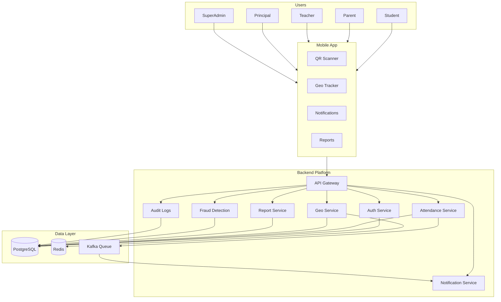

# MONITORING — Project Overview

**MONITORING** is a production-grade Smart Campus SaaS Platform for Schools, Colleges, Hostels, and Coaching Institutes.

It automates attendance, tracks student geo-location in real-time, provides parent visibility, detects fraud, and enforces role-based access — all in one secure, scalable platform.

---

## Goal

Provide secure QR attendance, real-time geo tracking, parent visibility, fraud detection, and complete monitoring across educational institutions.

---

## Core Pillars

| Pillar                | Description                                               |
| --------------------- | --------------------------------------------------------- |
| Attendance Discipline | QR + Manual attendance with time rules and audit trail    |
| Student Safety        | Real-time geo tracking, geo-fence alerts, SOS button      |
| Transparency          | Parents see live location, attendance, and performance    |
| Security              | JWT, device binding, RBAC, encrypted data, immutable logs |
| Fraud Prevention      | Fake GPS detection, proxy attendance, risk scoring        |
| Role-Based Control    | Fine-grained RBAC for every role in the system            |

---

## Platform Overview Diagram

---

## Key Metrics (Target)

| Metric           | Value                         |
| ---------------- | ----------------------------- |
| Supported Roles  | 8 roles                       |
| Core Modules     | 15 modules                    |
| Attendance Types | QR + Manual                   |
| Geo Tracking     | Real-time, every N minutes    |
| Alert Channels   | Push + Email + In-App         |
| Data Encryption  | AES-256 at rest, TLS 1.3      |
| Deployment       | Docker + Kubernetes + AWS/GCP |
| Target Clients   | Schools, Colleges, Hostels    |

---

## System Type

**Smart Campus Monitoring SaaS Platform**

Sell to: Schools, Colleges, Hostels, Coaching Institutes, Corporates
