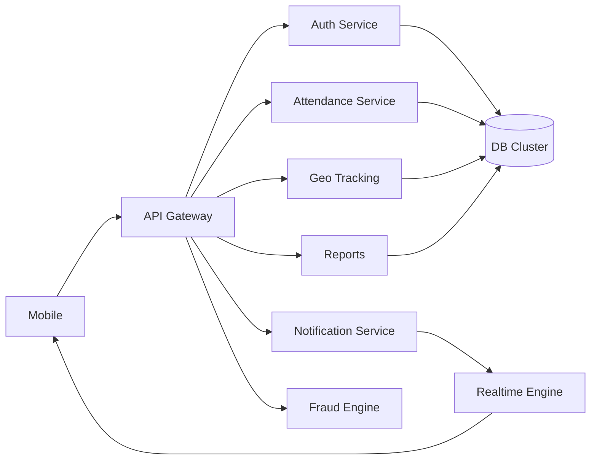

# Complete System Architecture

```mermaid
flowchart LR
Mobile --> APIGW[API Gateway]
APIGW --> AUTH[Auth Service]
APIGW --> ATT[Attendance Service]
APIGW --> GEO[Geo Tracking]
APIGW --> NOTI[Notification Service]
APIGW --> REP[Reports]
APIGW --> FRAUD[Fraud Engine]

AUTH --> DB[(DB Cluster)]
ATT --> DB
GEO --> DB
REP --> DB

NOTI --> WS[Realtime Engine]
WS --> Mobile
```
