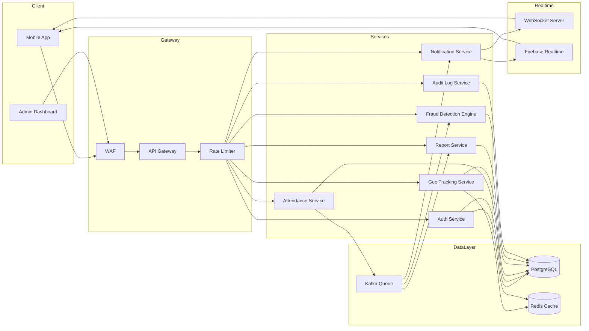
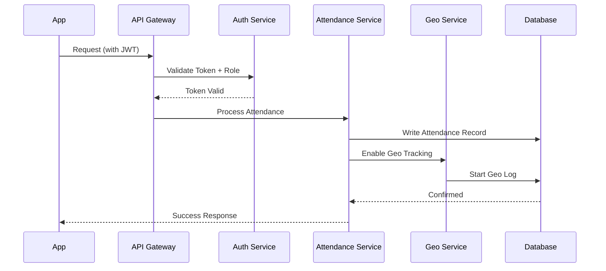
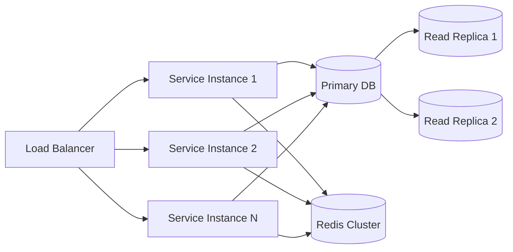

# System Design — MONITORING Platform

## Architecture Style

| Property    | Value                                |
| ----------- | ------------------------------------ |
| Pattern     | Microservices + Event-Driven         |
| Tenancy     | Multi-tenant (per college isolation) |
| Realtime    | WebSocket + Firebase                 |
| Scalability | Horizontal, stateless services       |
| Queue       | Kafka / BullMQ for async jobs        |
| Cache       | Redis for session + geo data         |

---

## Core Services

| Service                | Responsibility                                     |
| ---------------------- | -------------------------------------------------- |
| API Gateway            | Route, auth-check, rate-limit all requests         |
| Auth Service           | JWT, device binding, login anomaly detection       |
| Attendance Service     | QR scan, manual entry, time rule enforcement       |
| Geo Tracking Service   | Location updates, geofence check, timeline         |
| Notification Service   | Push, email, in-app alerts                         |
| Reporting Service      | Monthly reports, analytics, exports                |
| Fraud Detection Engine | Risk scoring, fake GPS, proxy attendance detection |
| Audit Log Service      | Immutable, time-stamped event logging              |

---

## System Design Diagram

---

## Data Flow

---

## Scalability Design

---

## Tech Stack

| Layer      | Technology                           |
| ---------- | ------------------------------------ |
| Mobile     | Flutter / React Native               |
| Backend    | Node.js / NestJS                     |
| Realtime   | WebSocket / Firebase                 |
| Database   | PostgreSQL                           |
| Cache      | Redis                                |
| Queue      | Kafka / BullMQ                       |
| Geo        | Google Maps API / Mapbox             |
| Cloud      | AWS / GCP                            |
| CI/CD      | Docker + Kubernetes + GitHub Actions |
| Monitoring | Prometheus + Grafana + ELK Stack     |
