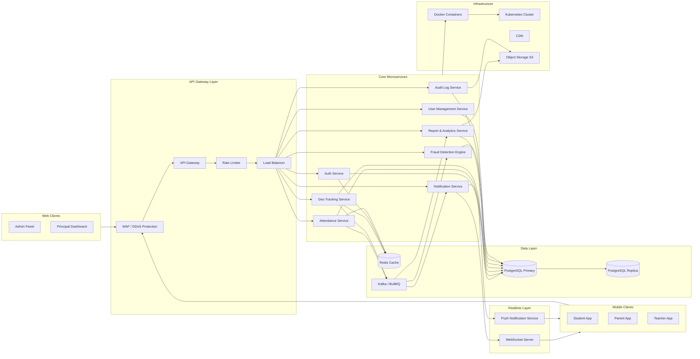
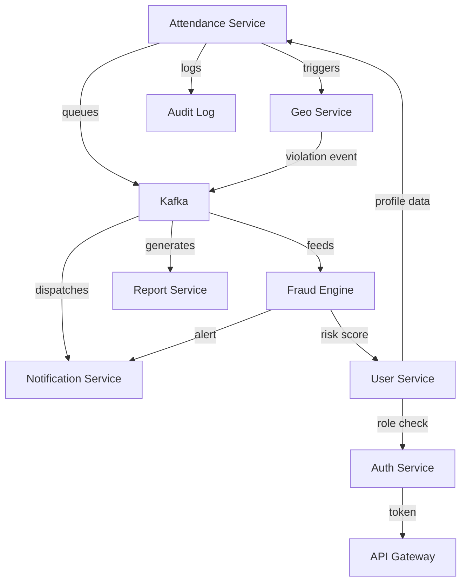
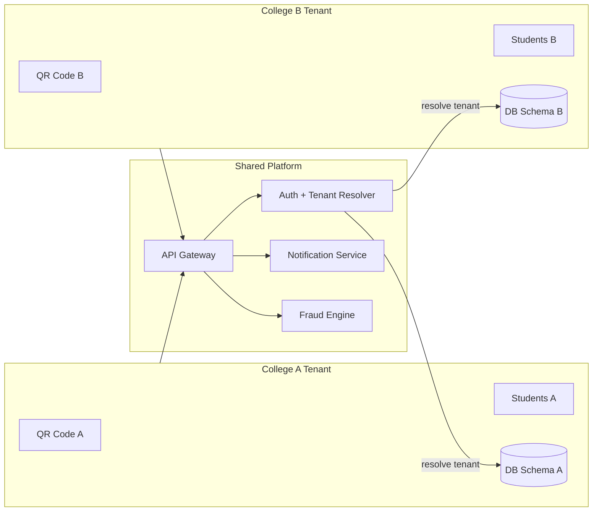
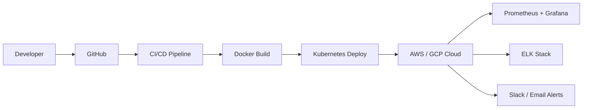

# Complete System Architecture — MONITORING

This document covers the full microservices architecture, service interactions, data flow, and infrastructure layout.

---

## Full Microservices Architecture

---

## Service Interaction Map

---

## Multi-Tenant Architecture (Per College Isolation)

---

## Infrastructure Layout

