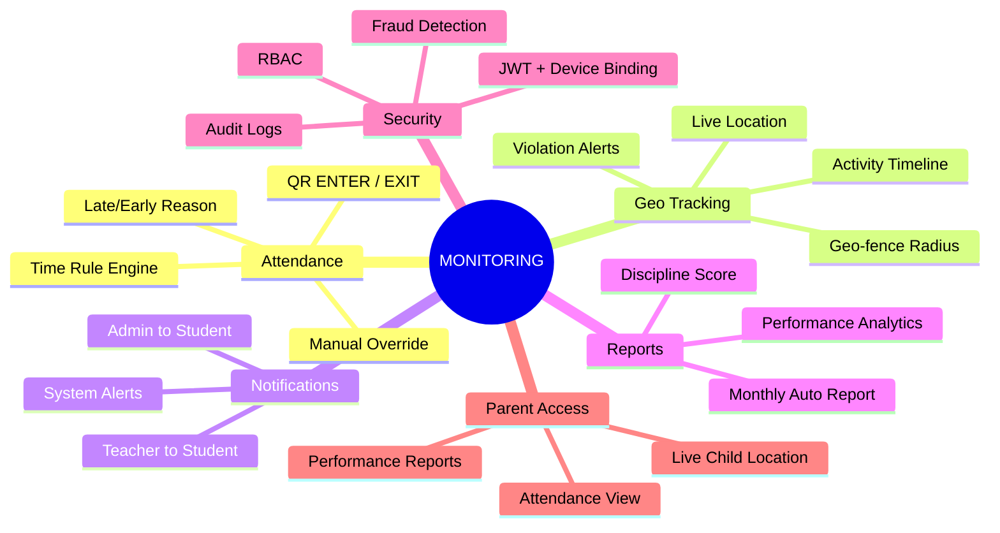
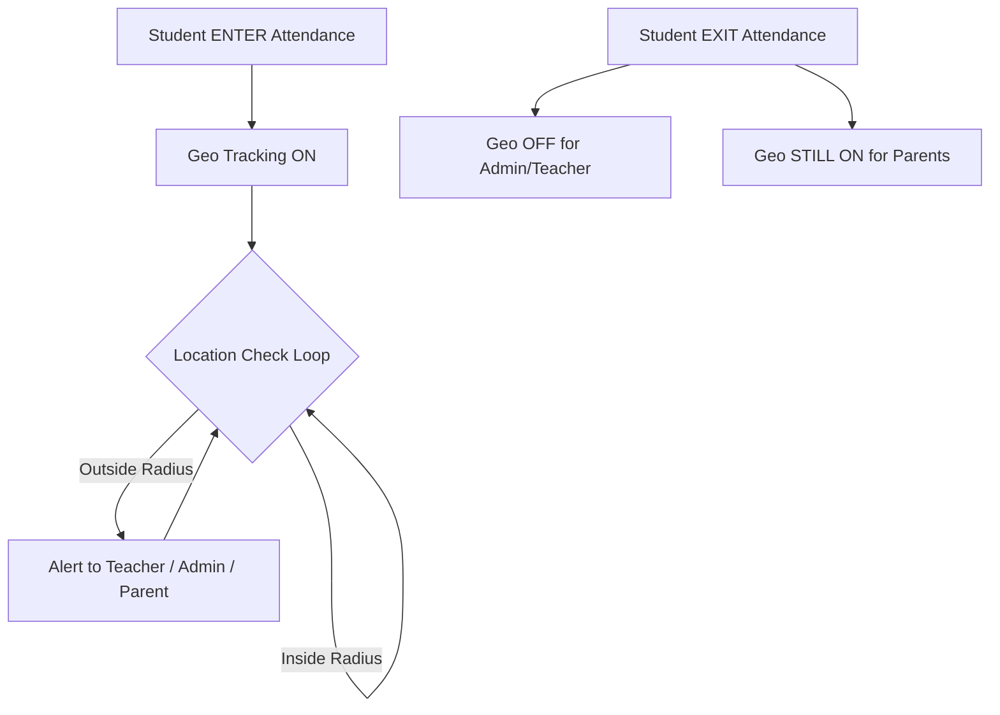
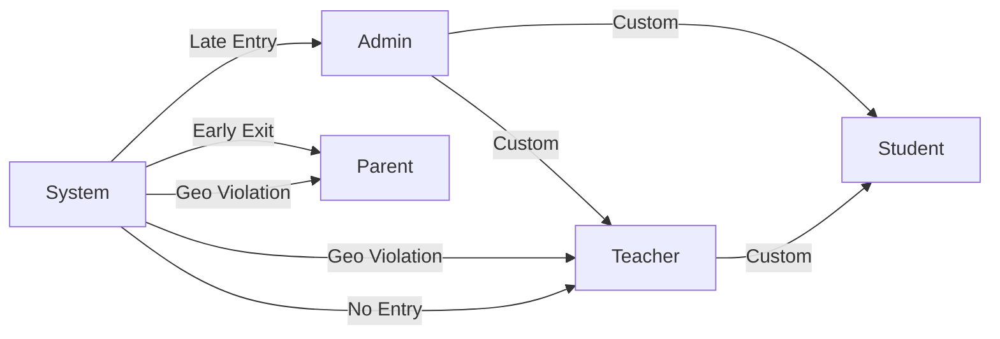

# Core Features — MONITORING Platform

## Feature Overview

---

## Feature Details

### 1. QR Attendance

| Rule         | Detail                                            |
| ------------ | ------------------------------------------------- |
| QR Scope     | Unique QR per college / campus                    |
| Actions      | ENTER or EXIT (student chooses after scan)        |
| Daily Limit  | 1 ENTER + 1 EXIT per day                          |
| ENTER Effect | Attendance start + Geo Tracking ON                |
| EXIT Effect  | Attendance end + Geo Tracking OFF (except parent) |
| Time Window  | 30 min before to 1 hour after entry time          |
| Late Entry   | Reason required                                   |

---

### 2. Manual Attendance

| Rule            | Detail                                 |
| --------------- | -------------------------------------- |
| Who Can Add     | Principal, CollegeManagement, Teacher  |
| Required Fields | ENTER + EXIT both mandatory            |
| Late Entry      | Reason mandatory                       |
| EXIT Rule       | Only after official exit time          |
| Audit Trail     | Added by role, user, timestamp, reason |

---

### 3. Geo Tracking

---

### 4. Notification Engine

---

### 5. Reports & Analytics

| Report Type          | Generated By | Sent To            | Frequency |
| -------------------- | ------------ | ------------------ | --------- |
| Attendance Report    | System       | Student + Parent   | Monthly   |
| Performance Report   | System       | Principal + Parent | Monthly   |
| Discipline Score     | System       | Principal          | Monthly   |
| Geo Violation Report | System       | Principal + Admin  | Weekly    |
| Audit Log Report     | System       | SuperAdmin         | On-demand |

---

### 6. Activity Audit Logs

All events tracked:

- Login / Logout
- Attendance (QR + Manual)
- Geo movement
- Device change
- Password change
- Notification sent
- Profile update
- Permission change
- Admin actions

All logs are **immutable, time-stamped, and role-tagged**.
