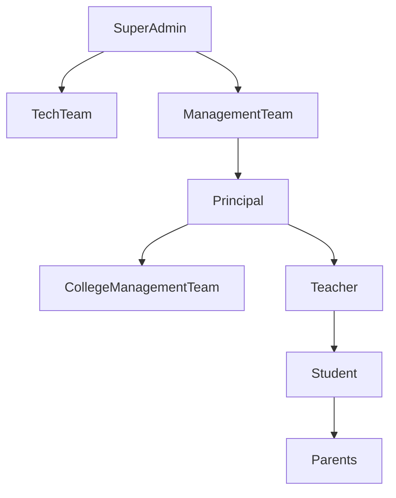
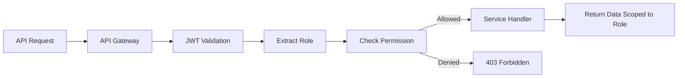
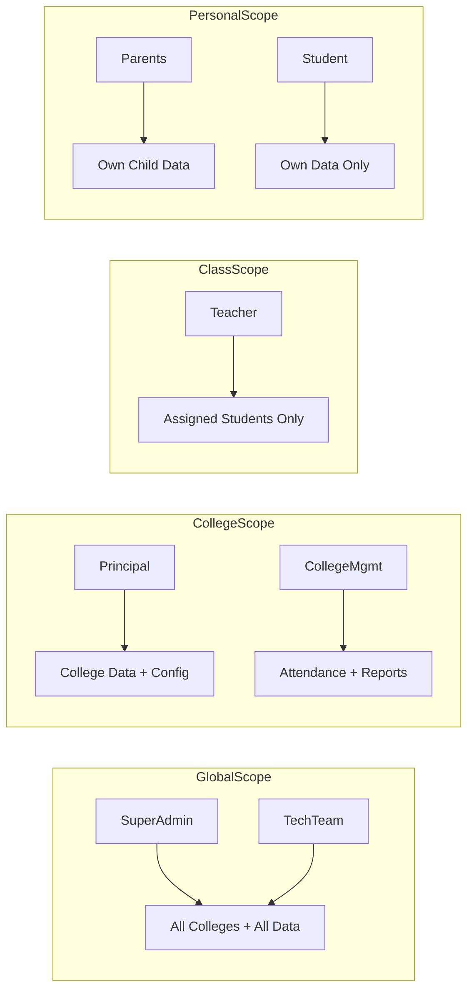

# Roles & Access Control — MONITORING Platform

## Role Hierarchy

---

## Role Definitions

| Role                  | Scope          | Description                                            |
| --------------------- | -------------- | ------------------------------------------------------ |
| SuperAdmin            | Global         | Full system control, all colleges, all data            |
| TechTeam              | Global         | Infrastructure, security, system health, deployments   |
| ManagementTeam        | Global         | High-level oversight across all colleges               |
| Principal             | College        | Full college control: timing, permissions, holidays    |
| CollegeManagementTeam | College        | Attendance, reports, alerts, limited geo visibility    |
| Teacher               | Assigned Class | Assigned students, attendance, manual override, alerts |
| Parents               | Child Only     | Live location, attendance, performance of own child    |
| Student               | Self Only      | Own attendance, geo status, alerts, performance        |

---

## Permission Matrix

| Permission               | SuperAdmin | TechTeam | Principal | CollegeMgmt | Teacher  | Parents | Student |
| ------------------------ | :--------: | :------: | :-------: | :---------: | :------: | :-----: | :-----: |
| View All Colleges        |    YES     |   YES    |    NO     |     NO      |    NO    |   NO    |   NO    |
| Manage System Config     |    YES     |   YES    |    NO     |     NO      |    NO    |   NO    |   NO    |
| View Audit Logs          |    YES     |   YES    |    YES    |   Limited   |    NO    |   NO    |   NO    |
| Configure College Rules  |    YES     |    NO    |    YES    |     NO      |    NO    |   NO    |   NO    |
| Add Holidays             |    YES     |    NO    |    YES    |     NO      |    NO    |   NO    |   NO    |
| Manage Roles/Permissions |    YES     |    NO    |    YES    |     NO      |    NO    |   NO    |   NO    |
| View All Students        |    YES     |   YES    |    YES    |     YES     | Assigned |   NO    |   NO    |
| Add Manual Attendance    |    YES     |    NO    |    YES    |     YES     |   YES    |   NO    |   NO    |
| View Geo (All Students)  |    YES     |   YES    |    YES    |   Limited   | Assigned |   NO    |   NO    |
| View Child Live Geo      |    YES     |    NO    |    YES    |     NO      |    NO    |   YES   |   NO    |
| View Own Attendance      |    YES     |    NO    |    YES    |     YES     |   YES    |   YES   |   YES   |
| Scan QR Attendance       |     NO     |    NO    |    NO     |     NO      |    NO    |   NO    |   YES   |
| Send Notifications       |    YES     |    NO    |    YES    |     YES     |   YES    |   NO    |   NO    |
| Export Reports           |    YES     |   YES    |    YES    |     YES     |    NO    |   NO    |   NO    |

---

## RBAC Flow

---

## Data Visibility by Role

