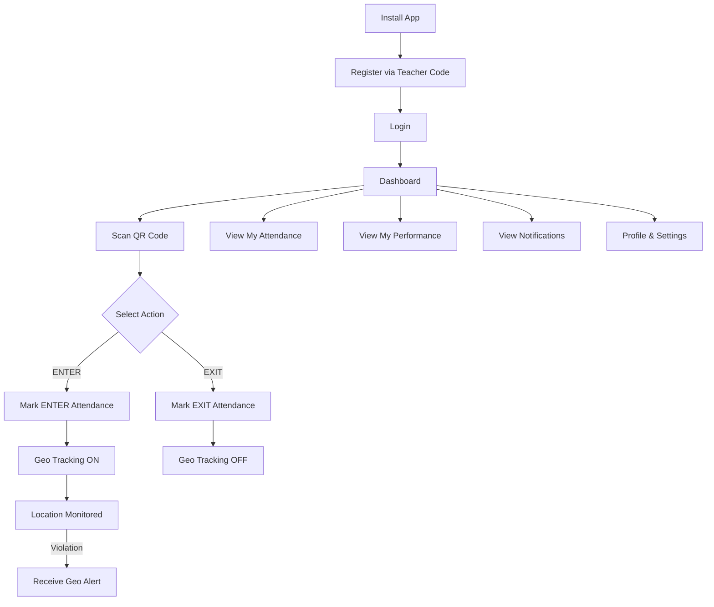
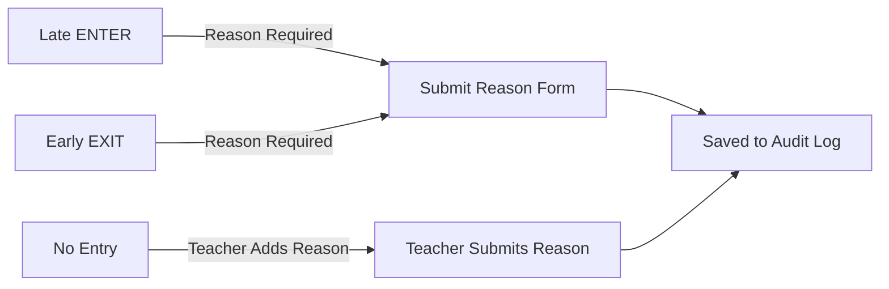
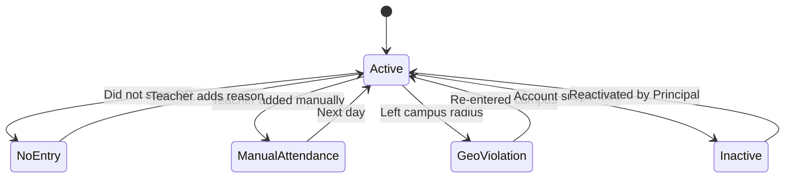

# Student Access — MONITORING Platform

## Student Role Overview

Students are the primary users of the mobile app. They interact with the system to mark attendance, view their own data, and receive alerts.

---

## Student App Flow

---

## Student Permissions

| Action                      | Allowed |
| --------------------------- | ------- |
| Scan QR for ENTER / EXIT    | YES     |
| View own attendance records | YES     |
| View own geo status         | YES     |
| Submit late / early reason  | YES     |
| View own performance score  | YES     |
| Receive push notifications  | YES     |
| View own monthly report     | YES     |
| Modify attendance records   | NO      |
| View other students' data   | NO      |
| Access admin features       | NO      |

---

## Student Reason Engine

---

## Student Status States

