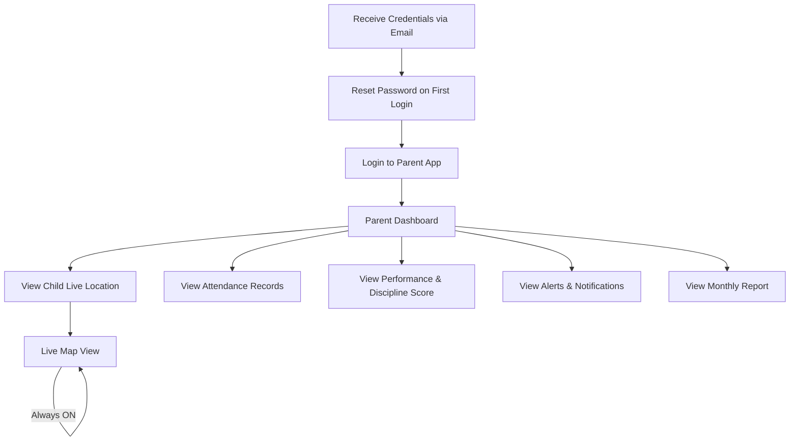
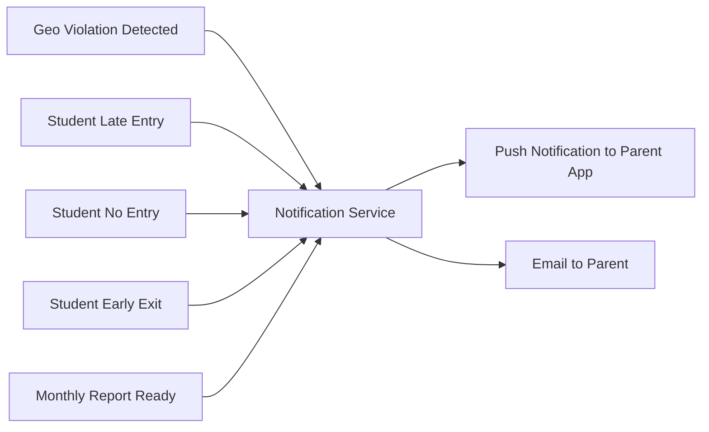
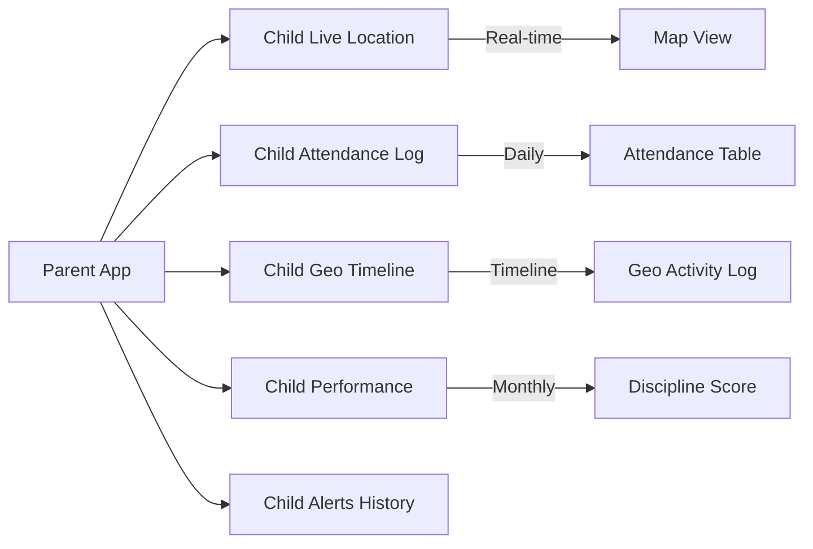

# Parents Access — MONITORING Platform

## Parent Role Overview

Parents have read-only access to their child's data. They can always see live location, attendance, and performance — even on holidays.

---

## Parent App Flow

---

## Parent Permissions

| Action                             | Allowed |
| ---------------------------------- | ------- |
| View child live location (always)  | YES     |
| View child attendance (ENTER/EXIT) | YES     |
| View child geo activity timeline   | YES     |
| View child monthly report          | YES     |
| View child performance score       | YES     |
| Receive geo violation alerts       | YES     |
| Receive late/absent alerts         | YES     |
| View location on holidays          | YES     |
| Modify any attendance data         | NO      |
| View other students' data          | NO      |
| Access admin or teacher features   | NO      |

---

## Parent Notification Flow

---

## Parent Data Visibility

