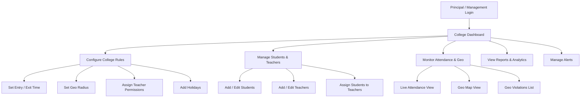
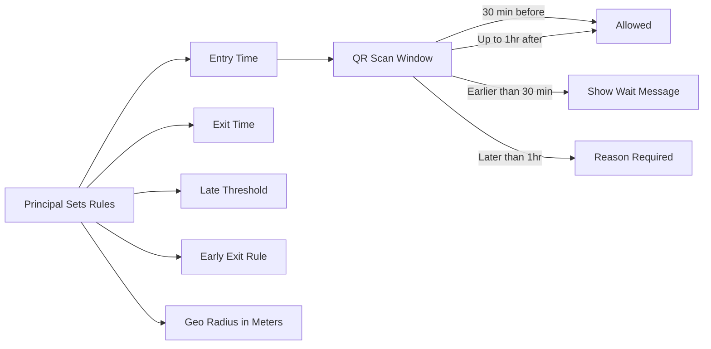
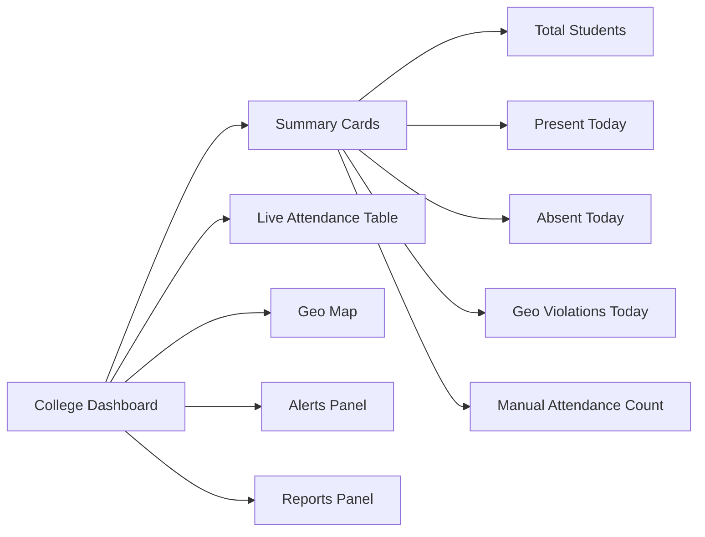

# College-Based Access — MONITORING Platform

## College Role Overview

College-level roles include **Principal** and **CollegeManagementTeam**. The Principal is the college super-admin who configures all rules. The management team handles day-to-day operations.

---

## College Admin Flow

---

## Principal Permissions

| Action                     | Principal | CollegeManagement |
| -------------------------- | :-------: | :---------------: |
| Configure entry/exit time  |    YES    |        NO         |
| Set geo radius             |    YES    |        NO         |
| Add holidays               |    YES    |        NO         |
| Assign teacher permissions |    YES    |        NO         |
| Add / edit students        |    YES    |        YES        |
| Add / edit teachers        |    YES    |        NO         |
| View all attendance        |    YES    |        YES        |
| Add manual attendance      |    YES    |        YES        |
| View geo (all students)    |    YES    |      Limited      |
| View reports & analytics   |    YES    |        YES        |
| Export reports             |    YES    |        YES        |
| Send notifications         |    YES    |        YES        |
| View audit logs            |    YES    |      Limited      |

---

## Time Rule Engine (Principal Configures)

---

## College Dashboard Layout

