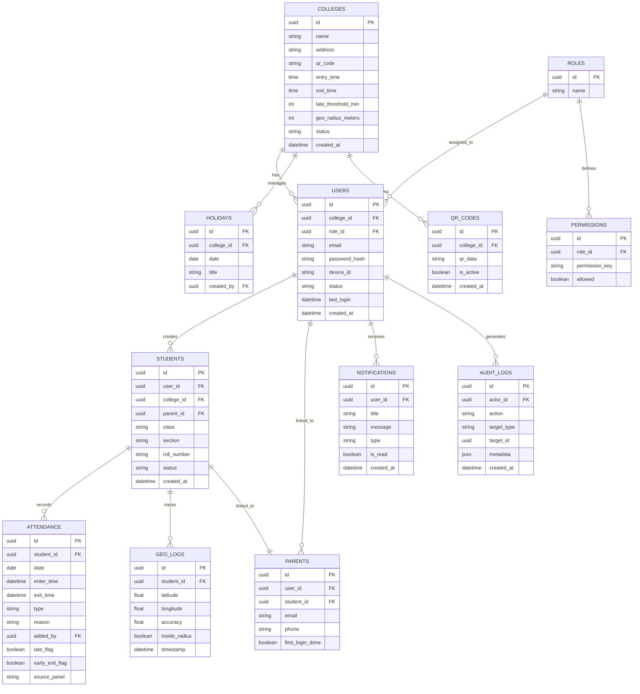
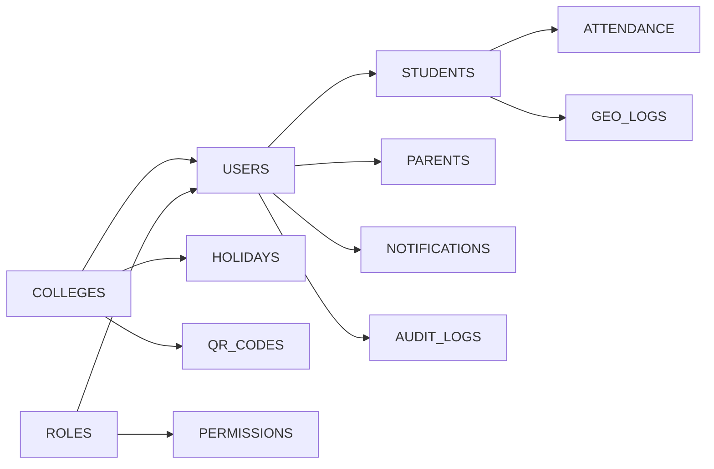

# Database Design — MONITORING Platform

## Database Type

| Layer      | Technology           | Purpose                          |
| ---------- | -------------------- | -------------------------------- |
| Primary DB | PostgreSQL           | All relational data              |
| Cache      | Redis                | Sessions, geo cache, rate limits |
| Queue      | Kafka / BullMQ       | Async jobs, notifications        |
| Storage    | AWS S3 / GCP Storage | Reports, exports, logs archive   |

---

## ER Diagram

---

## Table Relationships Summary

---

## Indexing Strategy

| Table         | Index Columns                        | Reason                     |
| ------------- | ------------------------------------ | -------------------------- |
| users         | email, college_id, role_id           | Fast login + role lookup   |
| students      | user_id, college_id, class           | Fast student queries       |
| attendance    | student_id, date, type               | Daily attendance queries   |
| geo_logs      | student_id, timestamp, inside_radius | Real-time geo queries      |
| audit_logs    | actor_id, created_at                 | Audit trail queries        |
| notifications | user_id, is_read, created_at         | Notification inbox queries |

---

## Security Rules

- All passwords hashed with **Argon2 / bcrypt**
- Sensitive fields encrypted at rest with **AES-256**
- Audit logs are **append-only** (no UPDATE/DELETE allowed)
- DB accessible only via **private VPC network**
- Read replicas for reporting queries (no load on primary)
