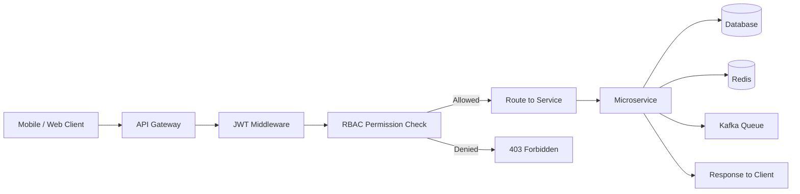
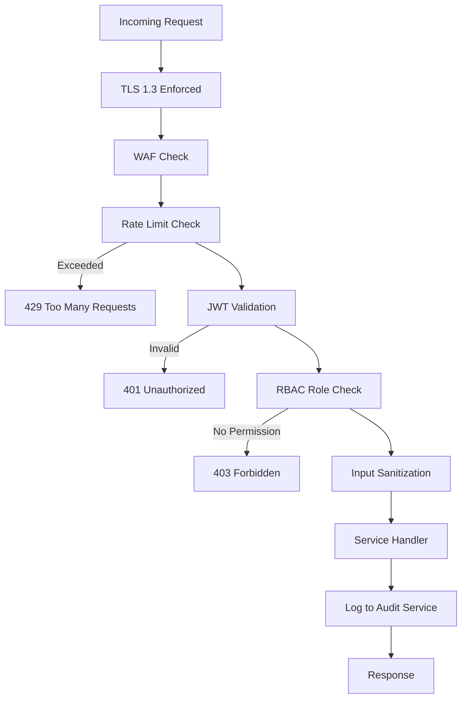

# API Design — MONITORING Platform

## API Style

| Property      | Value                        |
| ------------- | ---------------------------- |
| Style         | REST + WebSocket (Realtime)  |
| Format        | JSON                         |
| Auth          | JWT Bearer Token             |
| Rate Limiting | Per IP + Per User            |
| Versioning    | /api/v1/                     |
| Multi-tenant  | college_id resolved from JWT |

---

## API Architecture Flow

---

## Auth APIs

| Method | Endpoint                      | Role Required | Description                 |
| ------ | ----------------------------- | ------------- | --------------------------- |
| POST   | /api/v1/auth/login            | All           | Login with email + password |
| POST   | /api/v1/auth/logout           | All           | Logout and invalidate token |
| POST   | /api/v1/auth/refresh          | All           | Refresh JWT access token    |
| POST   | /api/v1/auth/device-bind      | All           | Bind device to account      |
| POST   | /api/v1/auth/register-student | Teacher       | Register new student        |
| POST   | /api/v1/auth/register-parent  | Teacher       | Register parent for student |

---

## Attendance APIs

| Method | Endpoint                       | Role Required            | Description                       |
| ------ | ------------------------------ | ------------------------ | --------------------------------- |
| POST   | /api/v1/attendance/qr-scan     | Student                  | Scan QR and get ENTER/EXIT prompt |
| POST   | /api/v1/attendance/enter       | Student                  | Mark ENTER attendance             |
| POST   | /api/v1/attendance/exit        | Student                  | Mark EXIT attendance              |
| POST   | /api/v1/attendance/manual      | Teacher/Principal/Mgmt   | Add manual attendance             |
| GET    | /api/v1/attendance/daily       | Teacher/Principal        | Get daily attendance list         |
| GET    | /api/v1/attendance/student/:id | Teacher/Principal/Parent | Get student attendance history    |
| GET    | /api/v1/attendance/report      | Principal/Mgmt           | Get monthly attendance report     |

---

## Geo Tracking APIs

| Method | Endpoint                 | Role Required  | Description                       |
| ------ | ------------------------ | -------------- | --------------------------------- |
| POST   | /api/v1/geo/update       | Student App    | Send current location coordinates |
| GET    | /api/v1/geo/status/:id   | Teacher/Parent | Get student current geo status    |
| GET    | /api/v1/geo/timeline/:id | Teacher/Parent | Get student geo activity timeline |
| POST   | /api/v1/geo/radius-check | System         | Check if student is inside radius |

---

## Notification APIs

| Method | Endpoint                | Role Required | Description               |
| ------ | ----------------------- | ------------- | ------------------------- |
| POST   | /api/v1/notify/send     | Admin/Teacher | Send custom notification  |
| GET    | /api/v1/notify/list     | All           | Get notification inbox    |
| PATCH  | /api/v1/notify/read/:id | All           | Mark notification as read |

---

## Report APIs

| Method | Endpoint                    | Role Required  | Description                |
| ------ | --------------------------- | -------------- | -------------------------- |
| GET    | /api/v1/reports/attendance  | Principal/Mgmt | Monthly attendance report  |
| GET    | /api/v1/reports/performance | Principal/Mgmt | Student performance report |
| GET    | /api/v1/reports/discipline  | Principal      | Discipline score report    |
| GET    | /api/v1/reports/export      | Principal/Mgmt | Export report as CSV/PDF   |

---

## Admin APIs

| Method | Endpoint                     | Role Required | Description                   |
| ------ | ---------------------------- | ------------- | ----------------------------- |
| POST   | /api/v1/admin/create-user    | Principal/SA  | Create teacher/student/parent |
| POST   | /api/v1/admin/set-permission | Principal     | Set teacher permissions       |
| POST   | /api/v1/admin/set-timing     | Principal     | Set entry/exit time rules     |
| POST   | /api/v1/admin/set-geo-radius | Principal     | Set geo radius for campus     |
| POST   | /api/v1/admin/add-holiday    | Principal     | Add holiday to calendar       |
| GET    | /api/v1/admin/audit-logs     | Principal/SA  | View audit logs               |

---

## API Security Rules

