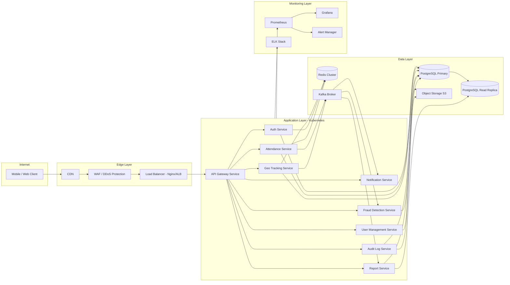
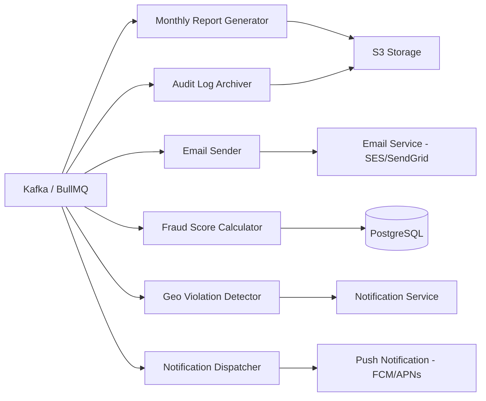
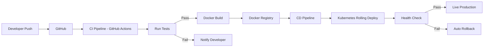

# Server Design — MONITORING Platform

## Backend Stack

| Component     | Technology           | Purpose                         |
| ------------- | -------------------- | ------------------------------- |
| Runtime       | Node.js / NestJS     | Core API services               |
| API Style     | REST + WebSocket     | Sync + Realtime communication   |
| Cache         | Redis                | Session, geo cache, rate limits |
| Queue         | Kafka / BullMQ       | Async background jobs           |
| Realtime      | WebSocket / Firebase | Live tracking, notifications    |
| Load Balancer | Nginx / AWS ALB      | Traffic distribution            |
| Container     | Docker               | Service packaging               |
| Orchestration | Kubernetes           | Auto-scaling, health management |

---

## Server Architecture Diagram

---

## Background Jobs (Queue-Based)

---

## Service Health & Monitoring

| Tool          | Purpose                                    |
| ------------- | ------------------------------------------ |
| Prometheus    | Metrics collection (CPU, memory, requests) |
| Grafana       | Dashboard visualization                    |
| ELK Stack     | Centralized log aggregation & search       |
| Alert Manager | Slack/Email alerts on threshold breach     |
| K8s Probes    | Liveness + Readiness health checks         |

---

## Deployment Pipeline

