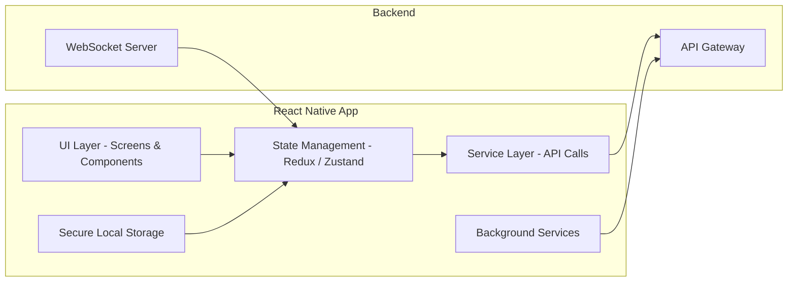
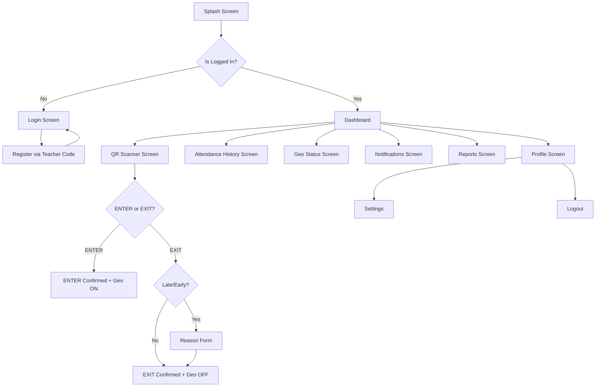
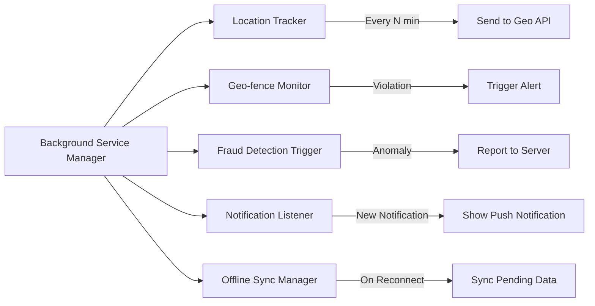
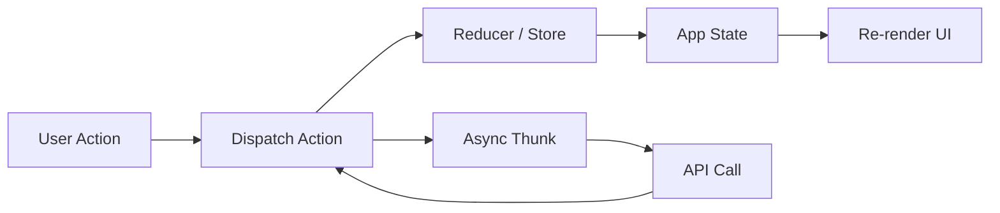

# Mobile APK Design — MONITORING Platform (React Native)

## Platform Support

| Platform | Distribution      | Min Version  |
| -------- | ----------------- | ------------ |
| Android  | Google Play Store | Android 8.0+ |
| iOS      | Apple App Store   | iOS 13+      |

---

## App Architecture

---

## App Screens & Navigation Flow

---

## Core Modules

| Module              | Description                                     |
| ------------------- | ----------------------------------------------- |
| Auth Module         | Login, Register, Device Bind, Token Refresh     |
| QR Scanner Module   | Camera-based QR scan, ENTER/EXIT action         |
| Attendance Module   | View attendance history, submit reasons         |
| Geo Tracking Module | Live location send, geo status view             |
| Notification Module | Push notification receive, inbox view           |
| Report Module       | Monthly report view, performance score          |
| Profile Module      | Profile view, settings, logout                  |
| Parent Module       | Live child map, child attendance, child reports |

---

## Background Services

---

## Security Implementation

| Security Layer           | Implementation                            |
| ------------------------ | ----------------------------------------- |
| Secure Storage           | Encrypted Keychain / Keystore             |
| Token Storage            | Secure storage (never plain AsyncStorage) |
| Device Binding           | Device fingerprint + server validation    |
| Root/Jailbreak Detection | react-native-device-info checks           |
| Fake GPS Detection       | Mock location detection via native module |
| Certificate Pinning      | SSL pinning for API calls                 |
| Screen Recording Block   | Prevent screenshots on sensitive screens  |

---

## State Management Flow

