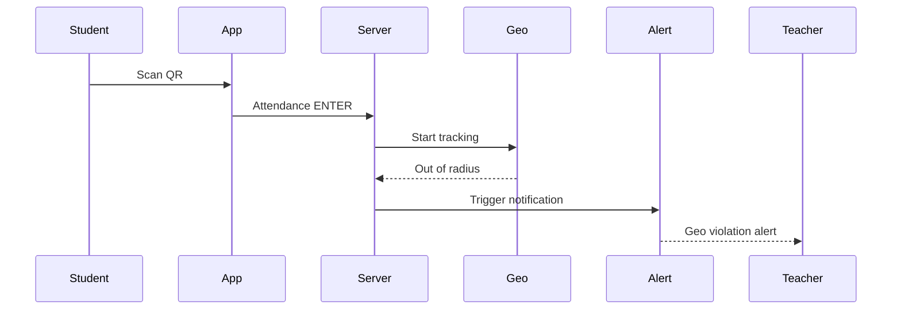

# Sequence — QR → Geo → Alert

```mermaid
sequenceDiagram
participant Student
participant App
participant Server
participant Geo
participant Alert

Student->>App: Scan QR
App->>Server: Attendance ENTER
Server->>Geo: Start tracking
Geo-->>Server: Out of radius
Server->>Alert: Trigger notification
Alert-->>Teacher: Geo violation alert
```
