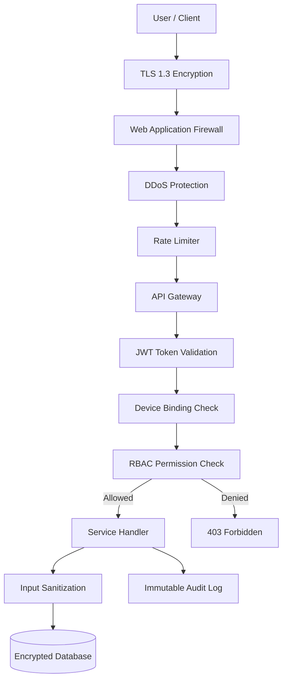
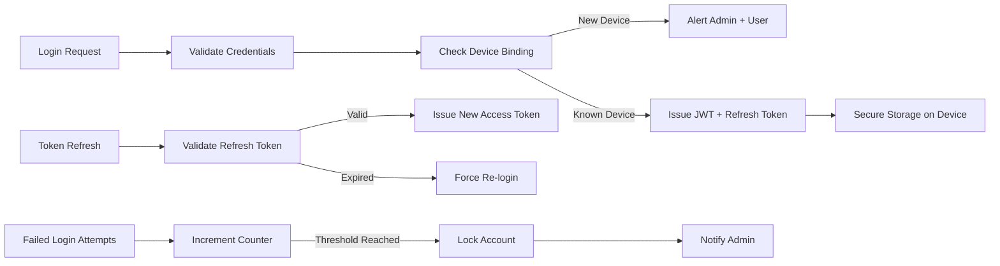
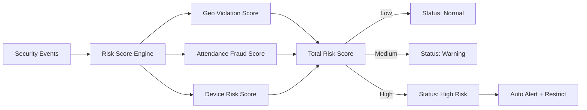

# Security Overview — MONITORING Platform

## Security Principles

| Principle               | Description                                               |
| ----------------------- | --------------------------------------------------------- |
| Zero Trust              | Every request verified — no implicit trust                |
| Least Privilege         | Each role gets minimum required access                    |
| End-to-End Encryption   | Data encrypted in transit (TLS 1.3) and at rest (AES-256) |
| Tamper-Proof Audit Logs | Append-only, immutable, time-stamped logs                 |
| Privacy First           | Parent consent required, data minimization policy         |
| Fraud Detection         | Fake GPS, proxy attendance, device abuse detection        |
| Device Binding          | One account bound to limited trusted devices              |

---

## Security Layers Diagram

---

## Authentication Security

---

## Data Encryption

| Data Type          | Encryption Method   | Where                |
| ------------------ | ------------------- | -------------------- |
| API Traffic        | TLS 1.3             | In Transit           |
| Passwords          | Argon2 / bcrypt     | At Rest (DB)         |
| Location Data      | AES-256             | At Rest (DB)         |
| Attendance Records | AES-256             | At Rest (DB)         |
| Auth Tokens        | Signed JWT (RS256)  | In Transit + Storage |
| Mobile Storage     | Keychain / Keystore | On Device            |

---

## Fraud Detection Rules

| Fraud Type                 | Detection Method                  | Action               |
| -------------------------- | --------------------------------- | -------------------- |
| Fake GPS                   | Mock location API detection       | Alert + Flag student |
| Proxy Attendance           | Device mismatch + location check  | Alert + Restrict     |
| Multiple Device Login      | Device fingerprint comparison     | Alert Admin          |
| Impossible Geo Movement    | Velocity anomaly (speed check)    | Flag + Alert         |
| Repeated Manual Attendance | Frequency threshold check         | Alert Principal      |
| QR Misuse                  | Time window + location validation | Reject + Log         |

---

## Risk Scoring System

---

## Infrastructure Security

| Layer              | Security Measure                            |
| ------------------ | ------------------------------------------- |
| Network            | Private VPC, no public DB access            |
| Firewall           | WAF + Security Groups                       |
| Secrets            | AWS Secrets Manager / GCP Secret Manager    |
| DB Access          | Private subnet only, encrypted connections  |
| Backup             | Encrypted backups, geo-redundant storage    |
| DDoS               | AWS Shield / Cloudflare protection          |
| Vulnerability Scan | Regular SAST + DAST scans in CI/CD pipeline |
