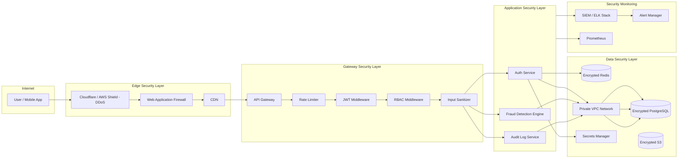
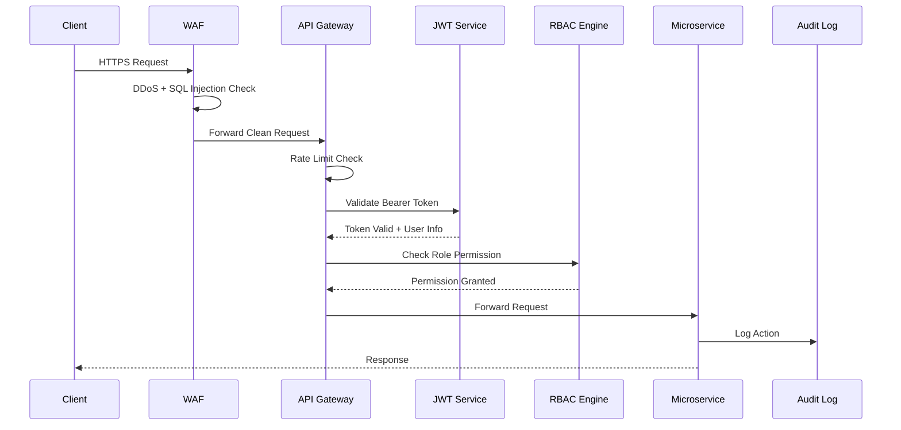
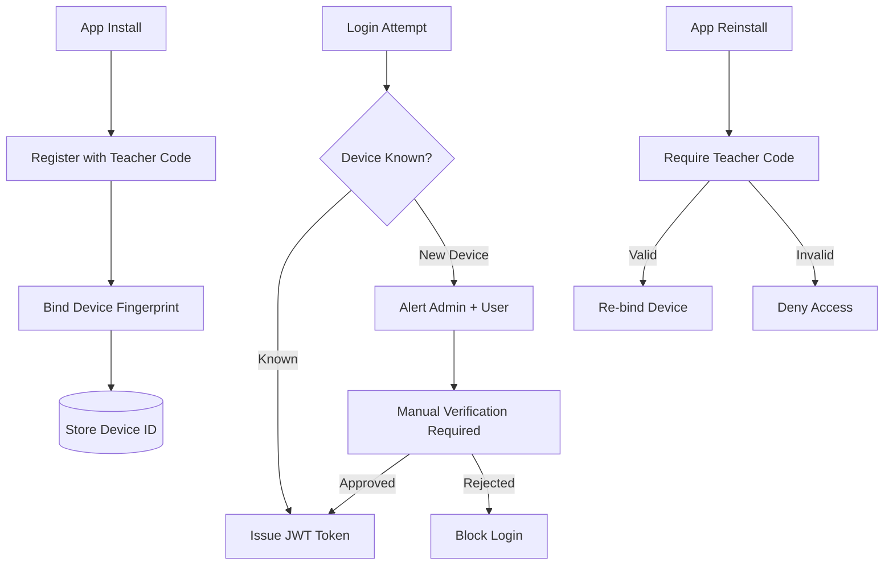
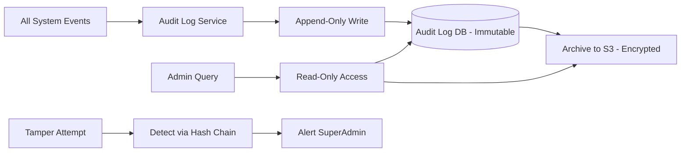

# Security Architecture — MONITORING Platform

## Security Architecture Overview

---

## Request Security Flow (Detailed)

---

## Device Security Flow

---

## Audit Log Architecture

---

## Security Compliance Checklist

| Requirement                 | Status   | Implementation                         |
| --------------------------- | -------- | -------------------------------------- |
| Data Encryption at Rest     | Required | AES-256 on all sensitive fields        |
| Data Encryption in Transit  | Required | TLS 1.3 enforced                       |
| Authentication              | Required | JWT + Refresh Token + Device Binding   |
| Authorization               | Required | RBAC + Fine-grained permissions        |
| Audit Logging               | Required | Immutable, append-only audit logs      |
| Parent Consent for Tracking | Required | Consent flow on first login            |
| Data Minimization           | Required | Only collect what is needed            |
| Right to Data Deletion      | Required | Admin can delete student data          |
| Brute Force Protection      | Required | Account lock after N failed attempts   |
| Fake GPS Detection          | Required | Mock location detection in app         |
| Root/Jailbreak Detection    | Required | Block app on rooted/jailbroken devices |
