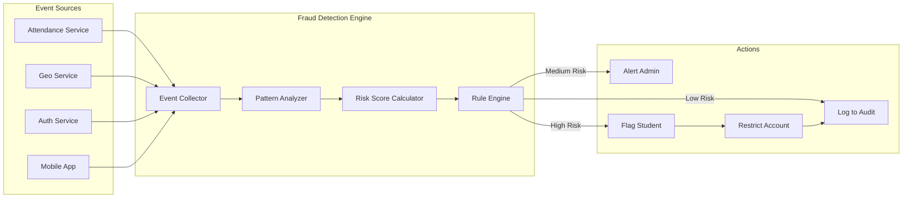
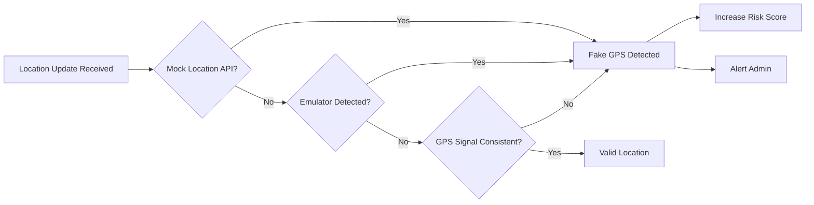
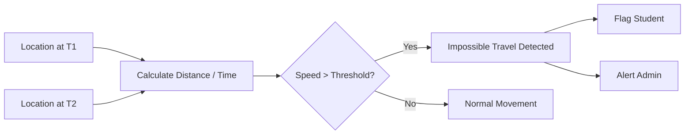
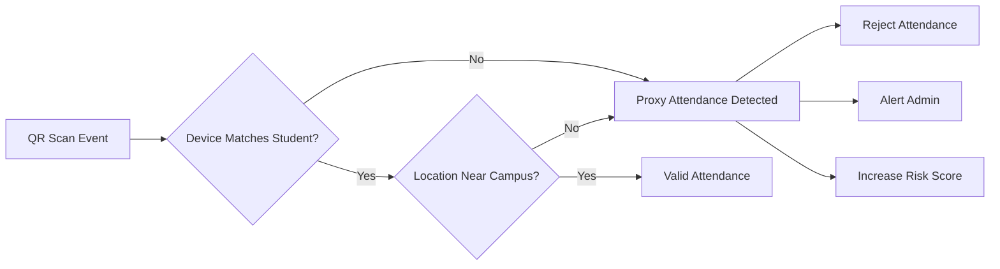
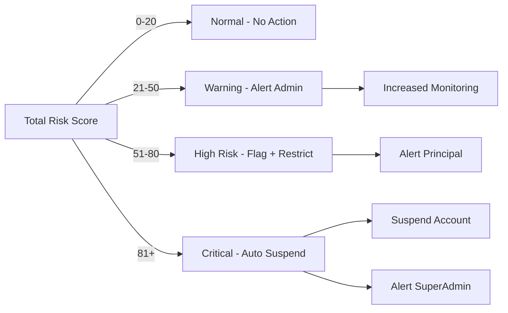

# Fraud Detection Engine — MONITORING Platform

## Overview

The Fraud Detection Engine runs as a dedicated microservice that continuously analyzes events, calculates risk scores, and triggers alerts or restrictions when fraud patterns are detected.

---

## Fraud Detection Architecture

---

## Fraud Detection Rules

### 1. Fake GPS Detection

---

### 2. Velocity Anomaly (Impossible Travel)

---

### 3. Proxy Attendance Detection

---

## Risk Scoring Matrix

| Event Type                    | Risk Points | Threshold for Action |
| ----------------------------- | :---------: | :------------------: |
| Fake GPS detected             |     +30     |     Alert at 30      |
| Impossible travel detected    |     +25     |     Alert at 25      |
| Proxy attendance attempt      |     +40     |     Alert at 40      |
| Multiple device login         |     +20     |     Alert at 20      |
| Repeated manual attendance    |  +10/event  |     Alert at 30      |
| QR scan outside time window   |     +5      |     Alert at 20      |
| Geo violation (out of radius) |  +5/event   |     Alert at 25      |

---

## Risk Level Classification

---

## Fraud Engine Actions

| Risk Level | Action                                                      |
| ---------- | ----------------------------------------------------------- |
| Low        | Log event to audit trail                                    |
| Medium     | Alert Admin + Teacher + increase monitoring frequency       |
| High       | Alert Principal + Flag student + restrict manual attendance |
| Critical   | Auto suspend account + Alert SuperAdmin + full audit review |

---

## Advanced Detection (AI/ML - Future)

- Behavior pattern learning per student
- Geo spoof pattern AI detection
- Anomaly detection using historical attendance data
- Predictive risk scoring based on trends
