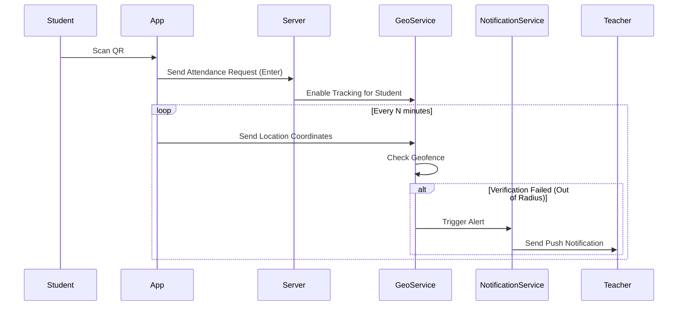

# Sequence — QR → Geo → Alert

```mermaid
sequenceDiagram
participant Student
participant App
participant Server
participant GeoService
participant NotificationService
participant Teacher

Student->>App: Scan QR
App->>Server: Send Attendance Request (Enter)
Server->>GeoService: Enable Tracking for Student
loop Every N minutes
    App->>GeoService: Send Location Coordinates
    GeoService->>GeoService: Check Geofence
    alt Verification Failed (Out of Radius)
        GeoService->>NotificationService: Trigger Alert
        NotificationService->>Teacher: Send Push Notification
    end
end
```
