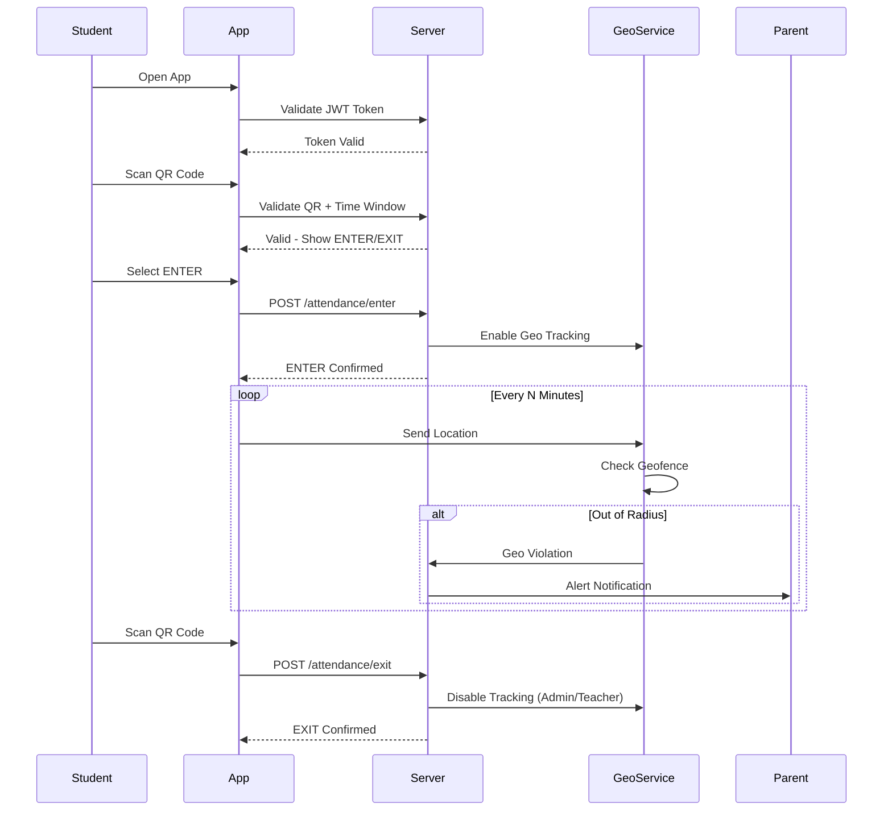
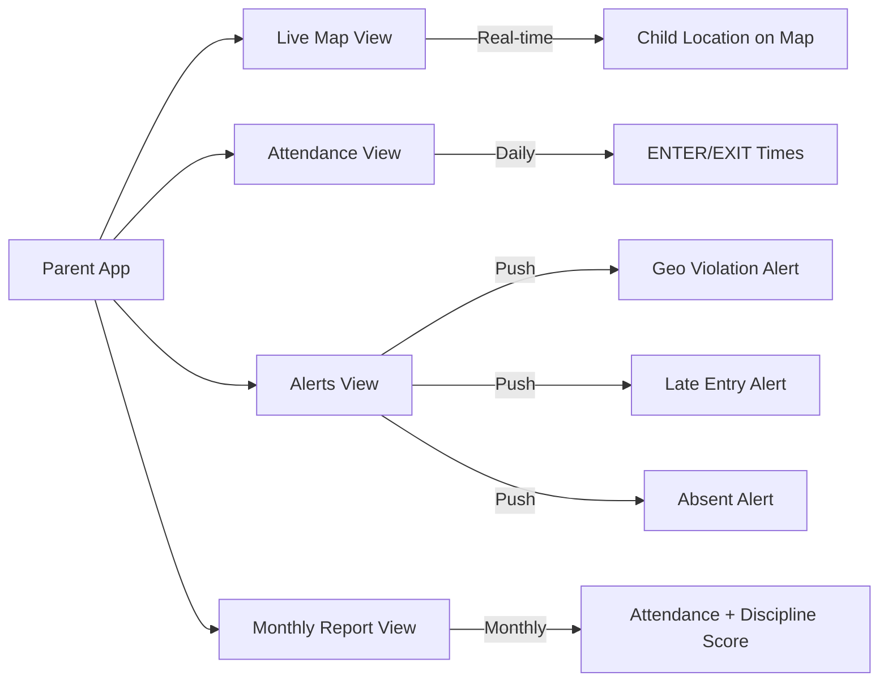
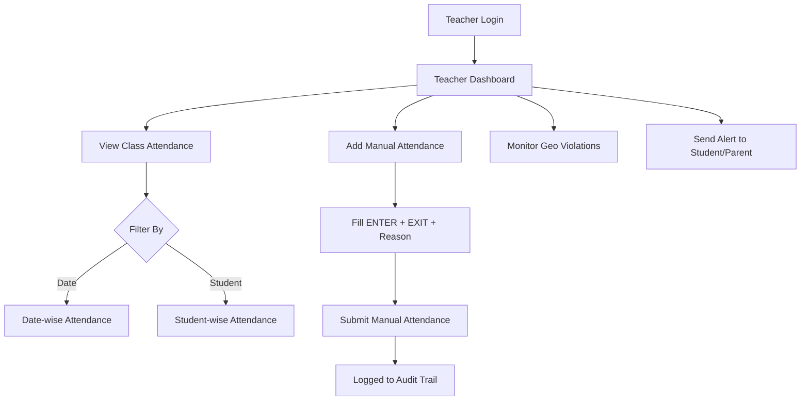

# User Flow — MONITORING Platform

## Complete User Journey Overview

```mermaid
flowchart TD
    subgraph StudentJourney[Student Journey]
        S1[Install App] --> S2[Register via Teacher Code]
        S2 --> S3[Login]
        S3 --> S4[Dashboard]
        S4 --> S5[Scan QR - ENTER]
        S5 --> S6[Geo Tracking ON]
        S6 --> S7[Campus Activities]
        S7 --> S8[Scan QR - EXIT]
        S8 --> S9[Geo Tracking OFF]
        S9 --> S10[Report Generated]
    end

    subgraph ParentJourney[Parent Journey]
        P1[Receive Credentials via Email] --> P2[First Login + Password Reset]
        P2 --> P3[Dashboard]
        P3 --> P4[Track Child Live Location]
        P3 --> P5[View Attendance]
        P3 --> P6[Receive Alerts]
        P3 --> P7[View Monthly Report]
    end

    subgraph TeacherJourney[Teacher Journey]
        T1[Login] --> T2[Dashboard]
        T2 --> T3[View Assigned Students]
        T2 --> T4[Monitor Attendance]
        T2 --> T5[Add Manual Attendance]
        T2 --> T6[Send Alerts]
        T2 --> T7[View Geo Violations]
    end

    subgraph PrincipalJourney[Principal Journey]
        PR1[Login] --> PR2[Dashboard]
        PR2 --> PR3[Configure Entry/Exit Time]
        PR2 --> PR4[Set Geo Radius]
        PR2 --> PR5[Manage Roles & Permissions]
        PR2 --> PR6[View Analytics]
        PR2 --> PR7[Export Reports]
        PR2 --> PR8[Add Holidays]
    end
```

---

## Student App Flow (Detailed)

---

## Parent Monitoring Flow

---

## Teacher Workflow

---

## System Value Summary

| Stakeholder | Value Delivered                                              |
| ----------- | ------------------------------------------------------------ |
| Student     | Easy QR attendance, transparent records, no proxy possible   |
| Parent      | Real-time child safety, live location, instant alerts        |
| Teacher     | Automated attendance, easy manual override, class insights   |
| Principal   | Full control, analytics, fraud detection, compliance reports |
| Institution | Reduced admin work, improved discipline, SaaS scalability    |
