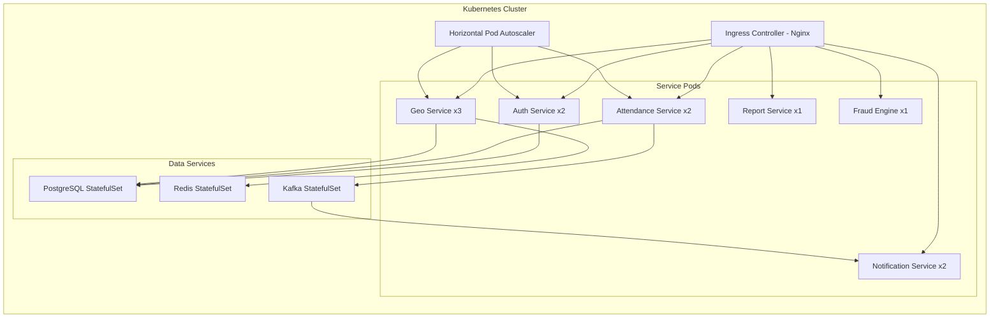

# Deployment — MONITORING Platform

## Deployment Strategy

| Property      | Value                                        |
| ------------- | -------------------------------------------- |
| Container     | Docker                                       |
| Orchestration | Kubernetes (K8s)                             |
| Cloud         | AWS / GCP (Multi-region capable)             |
| CI/CD         | GitHub Actions                               |
| Registry      | Docker Hub / AWS ECR / GCP Artifact Registry |
| Rollout       | Rolling Deploy (Zero Downtime)               |
| Rollback      | Auto rollback on health check failure        |

---

## Deployment Architecture

```mermaid
flowchart LR
    subgraph Development
        DEV[Developer] --> GIT[GitHub Repository]
    end

    subgraph CICD[CI/CD Pipeline - GitHub Actions]
        GIT --> LINT[Lint + Type Check]
        LINT --> TEST[Unit + Integration Tests]
        TEST -->|Pass| BUILD[Docker Build]
        TEST -->|Fail| NOTIFY_FAIL[Notify Developer]
        BUILD --> SCAN[Security Scan - SAST/DAST]
        SCAN --> PUSH[Push to Docker Registry]
    end

    subgraph Staging[Staging Environment]
        PUSH --> STAGE_DEPLOY[Deploy to Staging]
        STAGE_DEPLOY --> SMOKE[Smoke Tests]
        SMOKE -->|Pass| APPROVE[Manual Approval Gate]
        SMOKE -->|Fail| ROLLBACK_STAGE[Rollback Staging]
    end

    subgraph Production[Production - Kubernetes]
        APPROVE --> PROD_DEPLOY[Rolling Deploy to Production]
        PROD_DEPLOY --> HEALTH[Health Check Probes]
        HEALTH -->|Pass| LIVE[Live Production]
        HEALTH -->|Fail| AUTO_ROLLBACK[Auto Rollback]
    end

    subgraph Monitoring[Post-Deploy Monitoring]
        LIVE --> PROM[Prometheus Metrics]
        LIVE --> ELK[ELK Logs]
        PROM --> GRAFANA[Grafana Dashboard]
        ELK --> ALERT[Alert Manager]
    end
```

---

## Kubernetes Setup

---

## Environment Configuration

| Environment | Purpose                     | Auto Deploy | Approval Required |
| ----------- | --------------------------- | :---------: | :---------------: |
| Development | Local dev + feature testing |     NO      |        NO         |
| Staging     | Pre-production testing      |     YES     |        NO         |
| Production  | Live system                 |     NO      |        YES        |

---

## Security in Deployment

- HTTPS enforced via TLS certificates (Let's Encrypt / AWS ACM)
- WAF enabled on all public endpoints
- Secrets managed via AWS Secrets Manager / GCP Secret Manager
- Private VPC for all database connections
- Network policies restrict inter-service communication
- Regular automated security scans in CI pipeline
- Encrypted backups with geo-redundant storage
- Disaster recovery plan with RTO < 1 hour, RPO < 15 minutes
