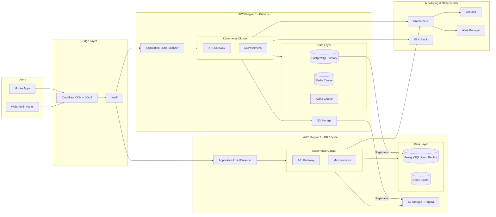
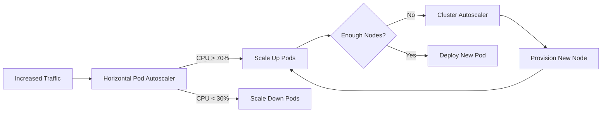
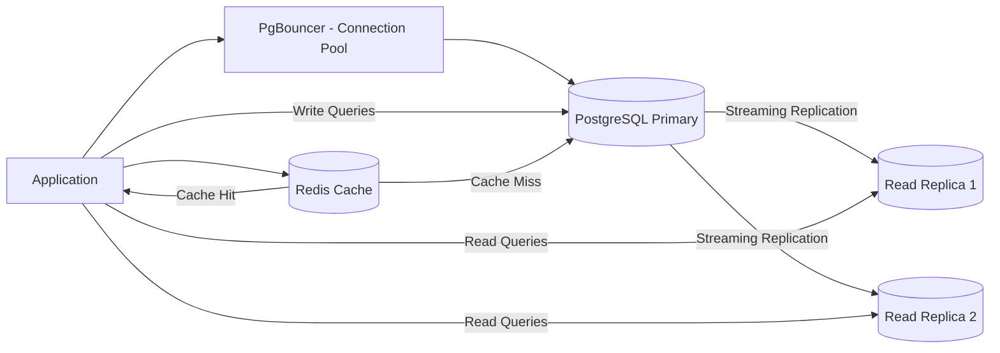

# Scalable Cloud Architecture — MONITORING Platform

## Cloud Strategy

| Property       | Value                                          |
| -------------- | ---------------------------------------------- |
| Primary Cloud  | AWS / GCP                                      |
| Multi-region   | Yes (Active-Active or Active-Passive)          |
| CDN            | Cloudflare / AWS CloudFront                    |
| Load Balancing | AWS ALB / GCP Load Balancer                    |
| Auto Scaling   | Kubernetes HPA + Cluster Autoscaler            |
| DB Scaling     | Read Replicas + Connection Pooling (PgBouncer) |
| Cache          | Redis Cluster (ElastiCache / Memorystore)      |

---

## Full Cloud Architecture Diagram

---

## Auto Scaling Strategy

---

## Database Scaling

---

## Cost Estimation by Scale

| Scale                | Compute | Database | Storage | Realtime/Push | Total/Month |
| -------------------- | ------- | -------- | ------- | ------------- | ----------- |
| MVP (1 college)      | $80     | $40      | $10     | $20           | ~$150       |
| Growth (10 colleges) | $300    | $150     | $50     | $80           | ~$580       |
| Scale (100 colleges) | $800    | $400     | $200    | $300          | ~$1,700     |
| Enterprise (500+)    | $2,000  | $1,000   | $500    | $800          | ~$4,300     |
