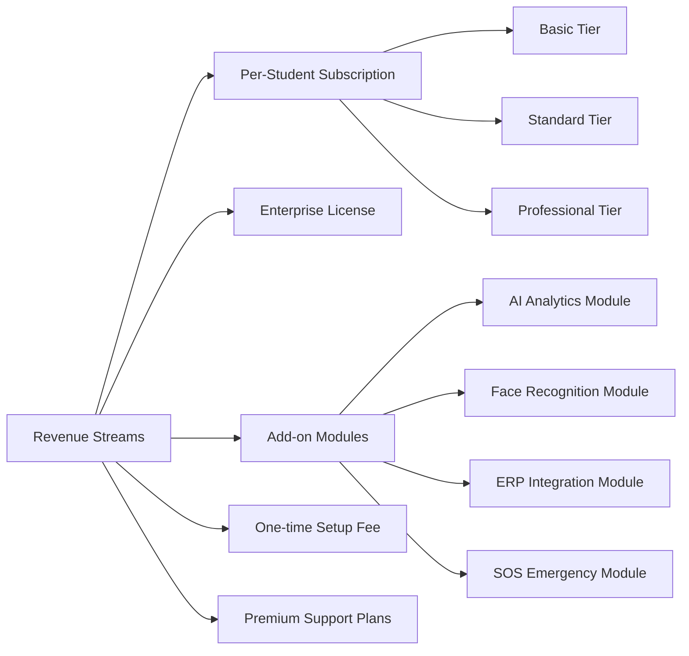

# SaaS Business & Pricing — MONITORING Platform

## Business Model

MONITORING operates as a **multi-tenant SaaS platform** sold to educational institutions on a per-student subscription basis.

---

## Pricing Tiers

| Tier         | Price                | Included Features                                              |
| ------------ | -------------------- | -------------------------------------------------------------- |
| Basic        | $1 / student / month | QR Attendance, Basic Reports, Email Alerts                     |
| Standard     | $2 / student / month | All Basic + Geo Tracking, Parent App, Push Notifications       |
| Professional | $3 / student / month | All Standard + Fraud Detection, Advanced Analytics, Audit Logs |
| Enterprise   | Custom pricing       | All Professional + Custom Integrations, SLA, Dedicated Support |

---

## Revenue Streams

---

## Go-To-Market Strategy

---

## Target Market

| Segment             | Size (India) | Potential Revenue (Standard Tier) |
| ------------------- | ------------ | --------------------------------- |
| Schools             | 1.5 million  | Massive                           |
| Colleges            | 50,000+      | High                              |
| Coaching Institutes | 100,000+     | High                              |
| Hostels             | 30,000+      | Medium                            |
| Corporate Training  | 10,000+      | Medium                            |

---

## SaaS Metrics (Target)

| Metric                    | MVP Target | Year 1 Target | Year 3 Target |
| ------------------------- | ---------- | ------------- | ------------- |
| Colleges Onboarded        | 5          | 50            | 500           |
| Students on Platform      | 5,000      | 50,000        | 500,000       |
| Monthly Recurring Revenue | $5,000     | $50,000       | $500,000      |
| Churn Rate                | < 10%      | < 5%          | < 3%          |
| NPS Score                 | > 40       | > 60          | > 70          |

---

## Competitive Advantages

| Feature                    | MONITORING | Traditional ERP | Basic Apps |
| -------------------------- | :--------: | :-------------: | :--------: |
| Real-time Geo Tracking     |    YES     |       NO        |     NO     |
| Fraud Detection Engine     |    YES     |       NO        |     NO     |
| Parent Live Monitoring     |    YES     |       NO        |  Partial   |
| QR + Manual Attendance     |    YES     |       YES       |  Partial   |
| RBAC + Fine-grained Perms  |    YES     |       YES       |     NO     |
| Multi-tenant SaaS          |    YES     |       NO        |     NO     |
| Mobile App (iOS + Android) |    YES     |     Partial     |    YES     |
| Immutable Audit Logs       |    YES     |     Partial     |     NO     |
