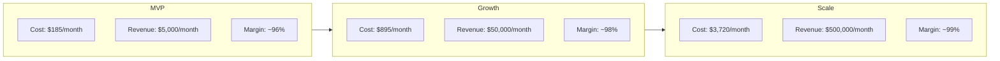

# Cost Estimation — MONITORING Platform (AWS / GCP)

## Infrastructure Cost Breakdown

### MVP Phase (1-5 Colleges, ~5,000 Students)

| Service               | AWS Service            | Cost/Month      |
| --------------------- | ---------------------- | --------------- |
| Compute (K8s Nodes)   | EKS + EC2 t3.medium x2 | $80             |
| Database (PostgreSQL) | RDS db.t3.medium       | $40             |
| Cache (Redis)         | ElastiCache t3.micro   | $15             |
| Object Storage        | S3 (50GB)              | $5              |
| Push Notifications    | FCM (Free tier)        | $0              |
| Email Service         | SES                    | $5              |
| CDN                   | CloudFront             | $10             |
| Load Balancer         | ALB                    | $20             |
| Monitoring            | CloudWatch             | $10             |
| **Total**             |                        | **~$185/month** |

---

### Growth Phase (10-50 Colleges, ~50,000 Students)

| Service               | AWS Service                 | Cost/Month      |
| --------------------- | --------------------------- | --------------- |
| Compute (K8s Nodes)   | EKS + EC2 m5.large x4       | $300            |
| Database (PostgreSQL) | RDS db.m5.large + 1 Replica | $200            |
| Cache (Redis)         | ElastiCache r6g.large       | $80             |
| Object Storage        | S3 (500GB)                  | $15             |
| Push Notifications    | FCM + SNS                   | $30             |
| Email Service         | SES                         | $20             |
| CDN                   | CloudFront                  | $30             |
| Load Balancer         | ALB x2                      | $40             |
| Monitoring            | CloudWatch + Grafana        | $30             |
| Kafka                 | MSK (Managed Kafka)         | $150            |
| **Total**             |                             | **~$895/month** |

---

### Scale Phase (100-500 Colleges, ~500,000 Students)

| Service               | AWS Service                    | Cost/Month        |
| --------------------- | ------------------------------ | ----------------- |
| Compute (K8s Nodes)   | EKS + EC2 m5.xlarge x10        | $1,200            |
| Database (PostgreSQL) | RDS db.r5.xlarge + 2 Replicas  | $800              |
| Cache (Redis)         | ElastiCache r6g.xlarge Cluster | $400              |
| Object Storage        | S3 (5TB)                       | $120              |
| Push Notifications    | FCM + SNS                      | $200              |
| Email Service         | SES                            | $100              |
| CDN                   | CloudFront                     | $150              |
| Load Balancer         | ALB x3                         | $100              |
| Monitoring            | Full Stack                     | $150              |
| Kafka                 | MSK Large                      | $500              |
| **Total**             |                                | **~$3,720/month** |

---

## Cost vs Revenue Analysis

---

## Cost Optimization Strategies

| Strategy                           | Estimated Saving              |
| ---------------------------------- | ----------------------------- |
| Reserved Instances (1-year)        | 30-40%                        |
| Spot Instances for batch jobs      | 60-70%                        |
| Read Replicas for reporting        | Reduces primary load          |
| Redis caching for frequent reads   | 40-60% DB cost reduction      |
| S3 lifecycle policies              | 20-30% storage cost reduction |
| Auto-scaling (scale down off-peak) | 20-30% compute saving         |
