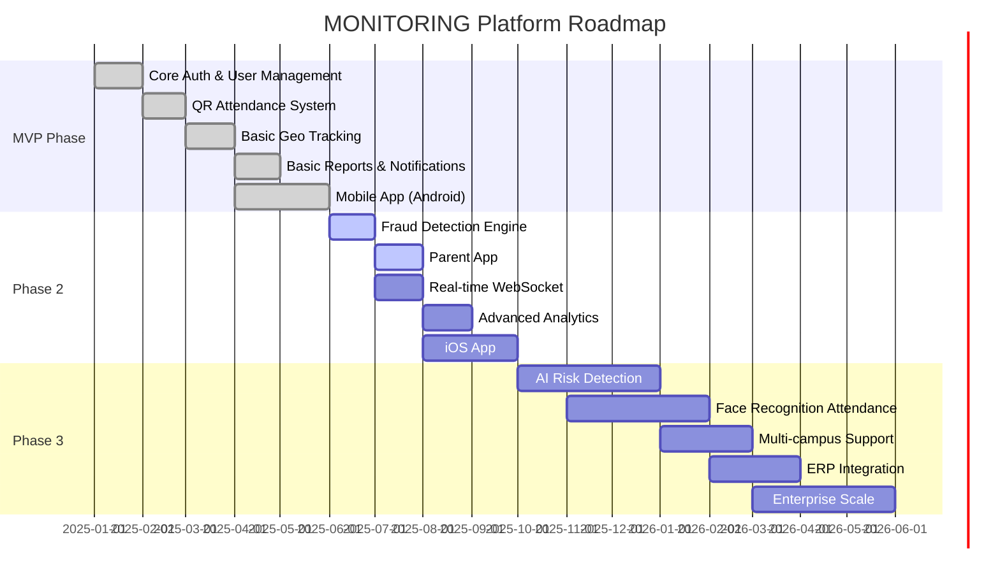
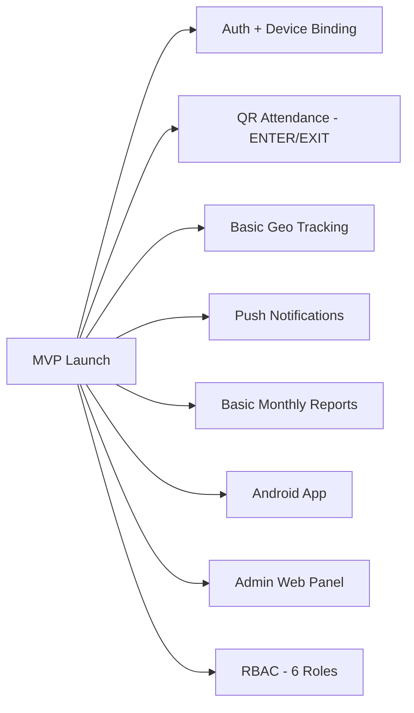
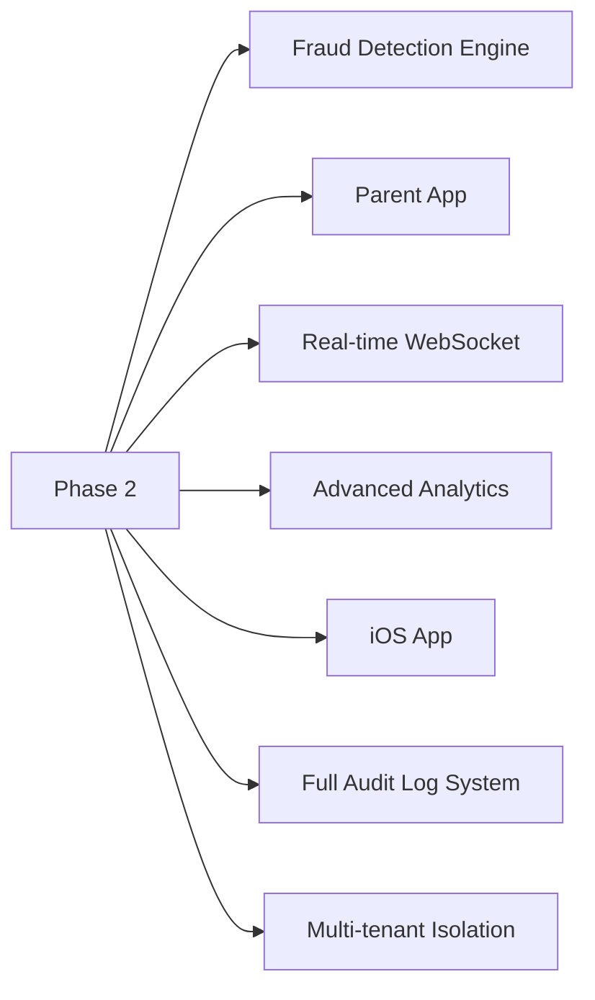
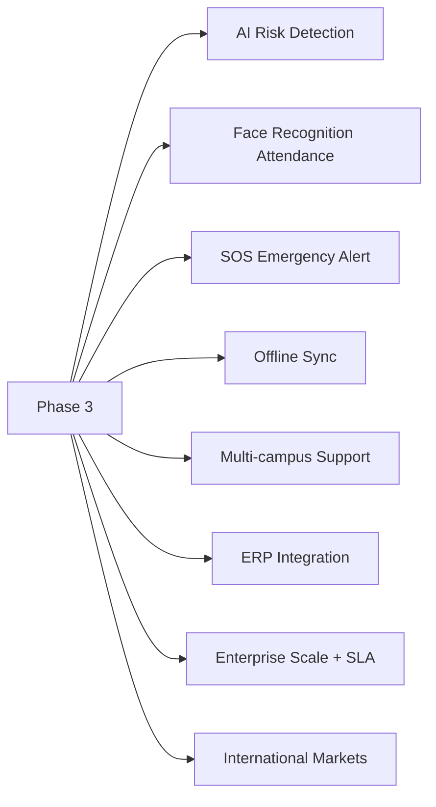

# MVP to Scale Roadmap — MONITORING Platform

## Roadmap Overview

---

## Phase Details

### MVP Phase (Months 1-6)

**Goal:** Onboard 5 pilot colleges, validate core features, gather feedback.

| Feature                   | Status   |
| ------------------------- | -------- |
| JWT Auth + Device Binding | Complete |
| QR ENTER / EXIT           | Complete |
| Manual Attendance         | Complete |
| Basic Geo Tracking        | Complete |
| Push Notifications        | Complete |
| Monthly Reports           | Complete |
| Android App               | Complete |
| Admin Web Panel           | Complete |
| 6 Roles RBAC              | Complete |

---

### Phase 2 — Growth (Months 7-12)

**Goal:** Expand to 50 colleges, launch parent app, activate fraud detection.

| Feature                | Status      |
| ---------------------- | ----------- |
| Fraud Detection Engine | In Progress |
| Parent App             | In Progress |
| Real-time WebSocket    | Planned     |
| Advanced Analytics     | Planned     |
| iOS App                | Planned     |
| Full Audit Logs        | Planned     |
| Multi-tenant Isolation | Planned     |

---

### Phase 3 — Scale & Enterprise (Months 13-24)

**Goal:** 500+ colleges, enterprise contracts, AI-powered features, international expansion.

---

## Success Metrics by Phase

| Metric               | MVP Target | Phase 2 Target | Phase 3 Target |
| -------------------- | ---------- | -------------- | -------------- |
| Colleges Onboarded   | 5          | 50             | 500            |
| Students on Platform | 5,000      | 50,000         | 500,000        |
| Monthly Revenue      | $5,000     | $50,000        | $500,000       |
| App Rating           | > 4.0      | > 4.3          | > 4.5          |
| Uptime SLA           | 99%        | 99.5%          | 99.9%          |
| Fraud Detection Rate | N/A        | > 80%          | > 95%          |
