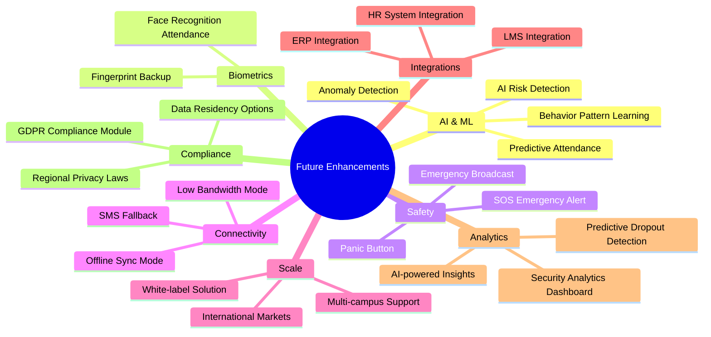
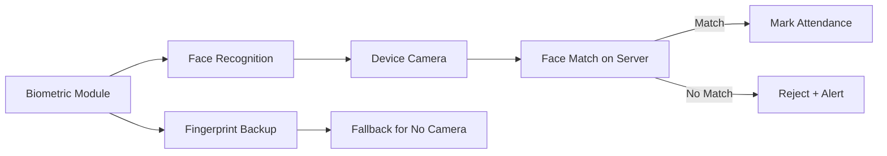
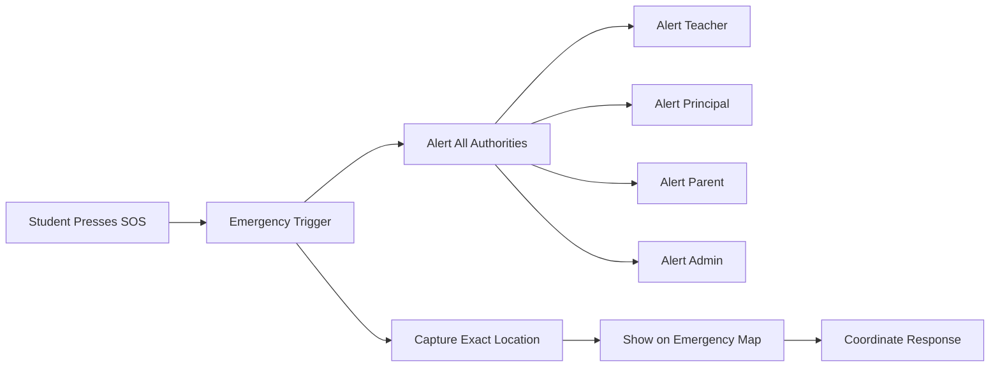
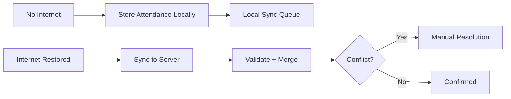
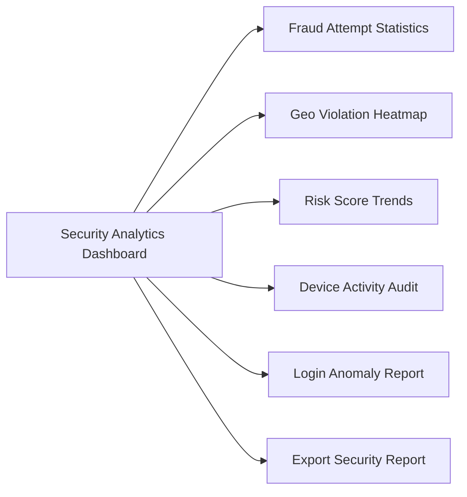

# Future Enhancements — MONITORING Platform

## Enhancement Roadmap

---

## Enhancement Details

### 1. AI & Machine Learning

| Feature                   | Description                                        | Priority |
| ------------------------- | -------------------------------------------------- | -------- |
| AI Risk Detection         | ML model to detect fraud patterns automatically    | High     |
| Behavior Pattern Learning | Learn normal student behavior, flag anomalies      | High     |
| Predictive Attendance     | Predict at-risk students before they become absent | Medium   |
| Geo Spoof AI Detection    | Advanced ML model to detect fake GPS patterns      | High     |

---

### 2. Biometric Attendance

---

### 3. SOS Emergency System

---

### 4. Offline Sync Mode

---

### 5. ERP & LMS Integration

| Integration         | Purpose                                         | Method     |
| ------------------- | ----------------------------------------------- | ---------- |
| ERP System          | Sync student data, fees, academic records       | REST API   |
| LMS (Moodle/Canvas) | Sync attendance with learning management system | Webhook    |
| HR System           | Sync teacher/staff data                         | REST API   |
| SMS Gateway         | Fallback notifications via SMS                  | REST API   |
| Email System        | Automated report delivery                       | SMTP / SES |

---

### 6. Security Analytics Dashboard

---

## Enhancement Priority Matrix

| Enhancement             | Impact | Effort | Priority |
| ----------------------- | :----: | :----: | :------: |
| AI Risk Detection       |  High  |  High  |    P1    |
| Face Recognition        |  High  |  High  |    P1    |
| SOS Emergency Alert     |  High  | Medium |    P1    |
| Offline Sync            | Medium | Medium |    P2    |
| ERP Integration         |  High  |  High  |    P2    |
| Multi-campus Support    |  High  | Medium |    P2    |
| Security Analytics Dash | Medium | Medium |    P2    |
| Predictive Dropout      | Medium |  High  |    P3    |
| White-label Solution    |  High  |  High  |    P3    |
| GDPR Compliance Module  | Medium | Medium |    P3    |
