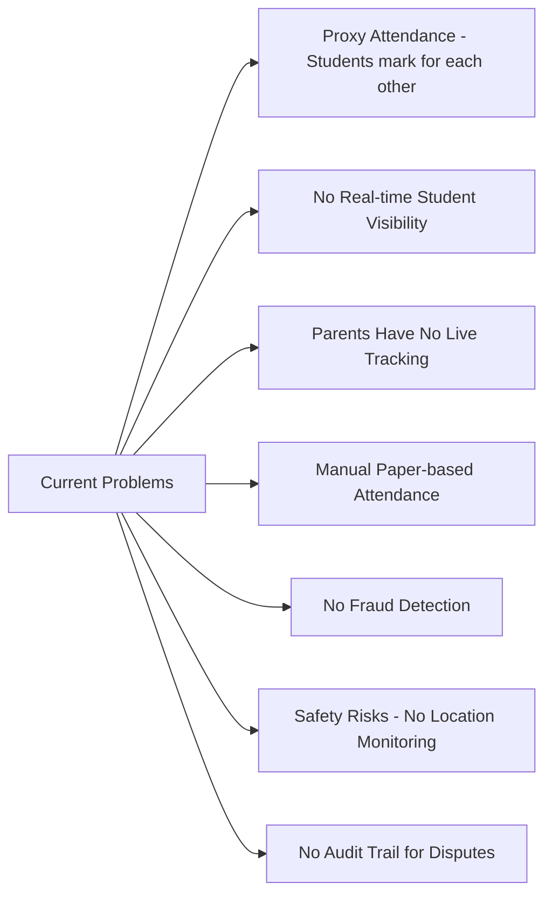
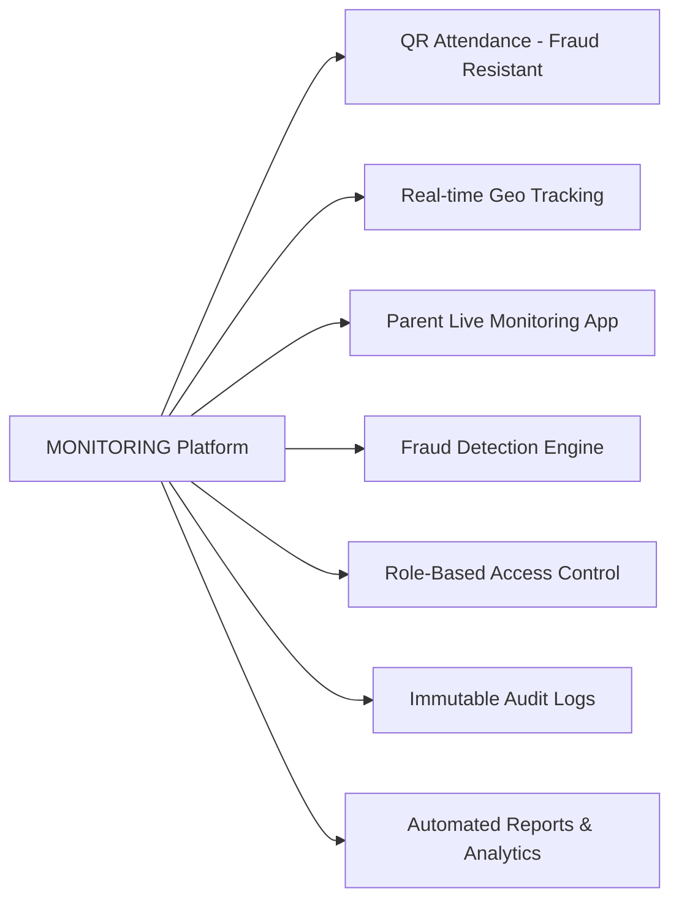
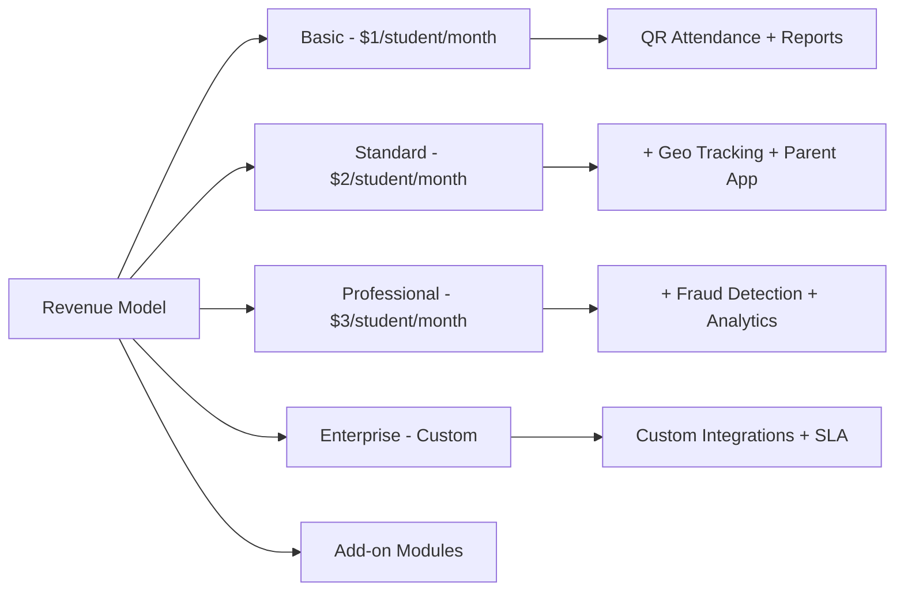
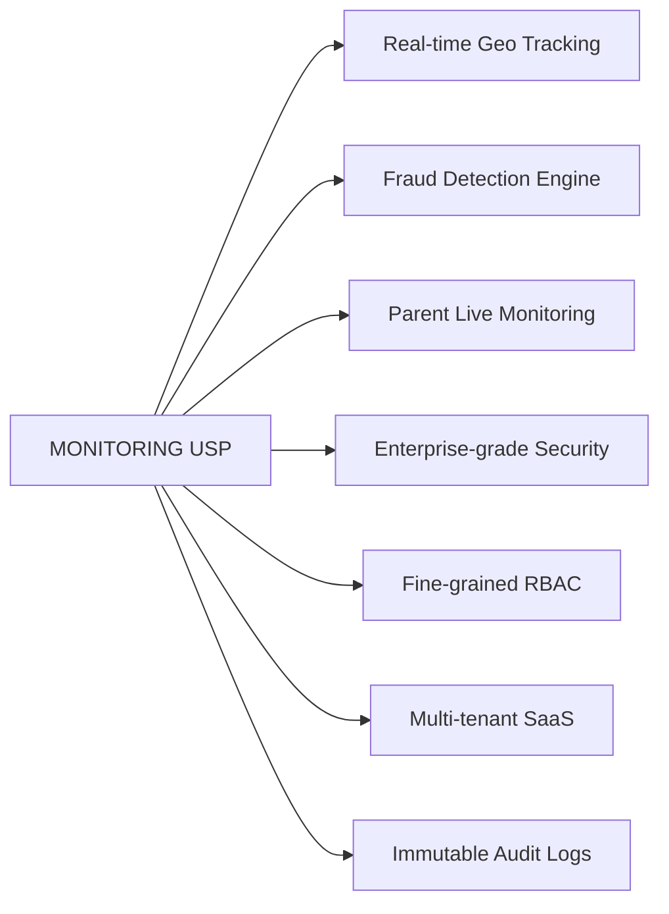

# Investor Pitch Deck — MONITORING Platform

## Executive Summary

**MONITORING** is a production-grade Smart Campus SaaS Platform that automates attendance, tracks student geo-location in real-time, provides parent visibility, and detects fraud — all in one secure, scalable system.

**Market:** 1.5M+ schools and 50,000+ colleges in India alone.
**Model:** Per-student SaaS subscription ($1-$3/student/month).
**Ask:** Seed investment for product build, pilot expansion, and sales team.

---

## Problem Statement

---

## Solution

---

## Market Opportunity

| Segment             | Count (India) | Avg Students | Addressable Market (Standard Tier) |
| ------------------- | ------------- | ------------ | ---------------------------------- |
| Schools             | 1,500,000     | 500          | $750M/month                        |
| Colleges            | 50,000        | 2,000        | $100M/month                        |
| Coaching Institutes | 100,000       | 200          | $20M/month                         |
| Hostels             | 30,000        | 300          | $9M/month                          |

---

## Business Model

---

## Traction & Milestones

| Milestone              | Status      | Timeline |
| ---------------------- | ----------- | -------- |
| Core Platform Built    | Complete    | Done     |
| Android App Ready      | Complete    | Done     |
| Pilot - 5 Colleges     | In Progress | Q1 2025  |
| Fraud Detection Engine | In Progress | Q2 2025  |
| Parent App Launch      | Planned     | Q3 2025  |
| iOS App Launch         | Planned     | Q3 2025  |
| 50 Colleges Onboarded  | Planned     | Q4 2025  |
| 500 Colleges Onboarded | Planned     | 2026     |

---

## Unique Selling Proposition

---

## Financial Projections

| Year   | Colleges | Students | Monthly Revenue | Annual Revenue |
| ------ | -------- | -------- | --------------- | -------------- |
| Year 1 | 50       | 50,000   | $50,000         | $600,000       |
| Year 2 | 200      | 200,000  | $200,000        | $2,400,000     |
| Year 3 | 500      | 500,000  | $500,000        | $6,000,000     |

---

## Team & Investment Ask

| Role              | Responsibility                          |
| ----------------- | --------------------------------------- |
| Founder / CTO     | Architecture, Product, Tech Leadership  |
| Backend Engineers | API, Microservices, Security            |
| Mobile Engineers  | React Native Android + iOS              |
| DevOps Engineer   | Kubernetes, CI/CD, Cloud Infrastructure |
| Sales & Marketing | College Partnerships, GTM Strategy      |

**Investment Ask:** $500,000 Seed Round

**Use of Funds:**

- 40% — Engineering team (hire 5 engineers)
- 25% — Sales & marketing (college partnerships)
- 20% — Infrastructure & cloud costs
- 15% — Operations & legal

**Runway:** 18 months to reach 200 colleges and $200K MRR.
