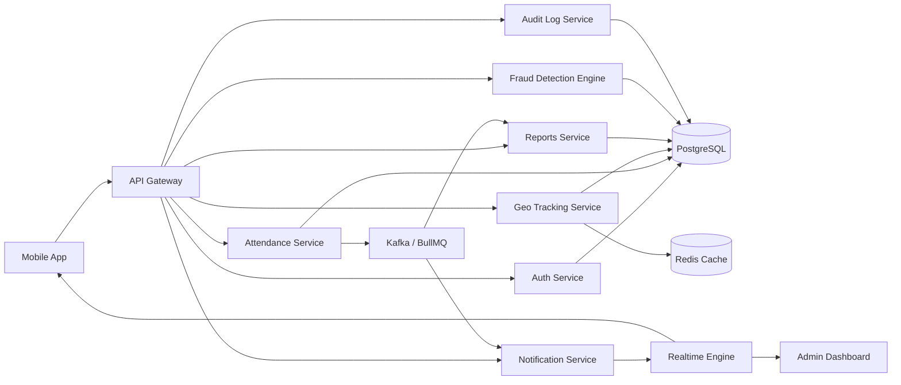
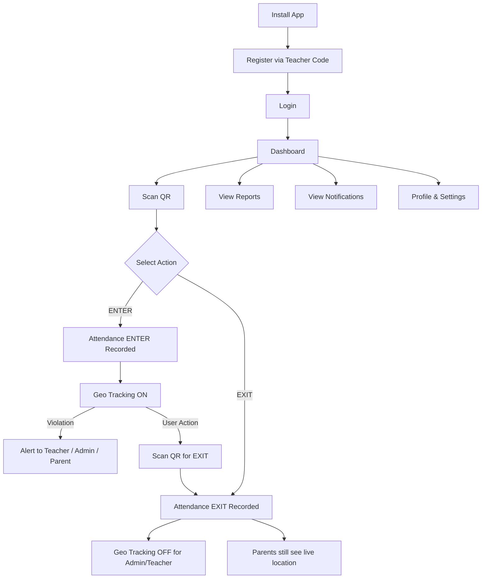
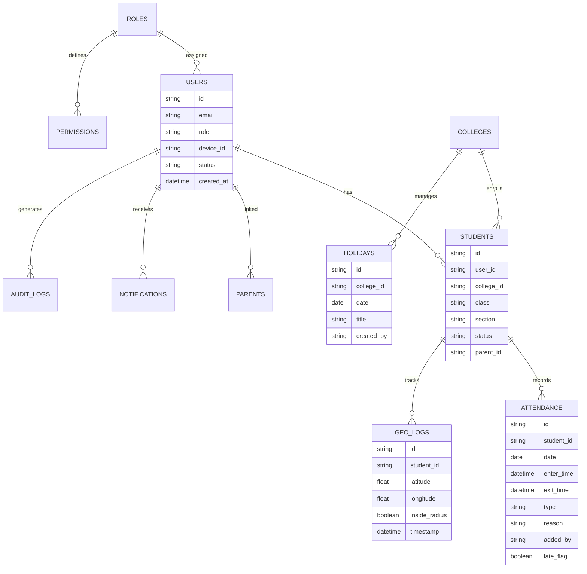
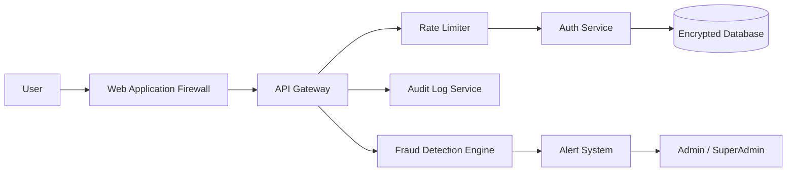
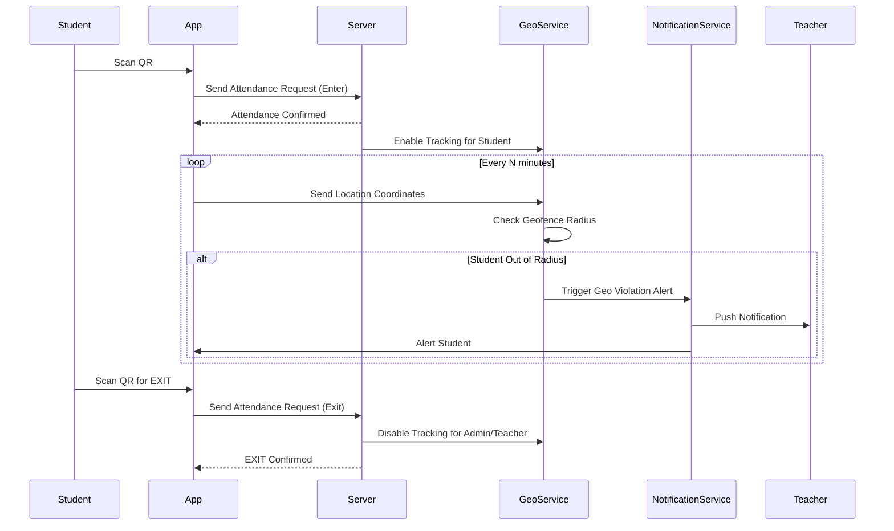

# MONITORING — Smart Campus Monitoring & Attendance Platform

**MONITORING** is a production-grade Smart Campus SaaS platform for Schools, Colleges, Hostels, and Coaching Institutes.

It provides QR-based attendance, real-time geo tracking, parent live monitoring, fraud detection, manual attendance backup, role & permission based access, security audit logs, and reports & analytics.

This system improves **discipline, safety, transparency, and automation** across educational institutions.

---

# Table of Contents

1. [Overview](#overview)
2. [Roles](#roles)
3. [Core Modules](#core-modules)
4. [Role Data Visibility](#role-data-visibility)
5. [Advanced Smart Features](#advanced-smart-features)
6. [Security & Privacy](#security--privacy)
7. [Tech Stack](#tech-stack)
8. [System Architecture Diagram](#system-architecture-diagram)
9. [App Flow Diagram](#app-flow-diagram)
10. [Database ER Diagram](#database-er-diagram)
11. [Security Architecture Diagram](#security-architecture-diagram)
12. [Sequence: QR -> Geo -> Alert](#sequence-qr---geo---alert)
13. [Business Model](#business-model)
14. [Future Enhancements](#future-enhancements)

---

# Overview

| Feature                   | Description                                   |
| ------------------------- | --------------------------------------------- |
| QR Attendance             | Unique QR per college, ENTER / EXIT per day   |
| Manual Attendance         | Override by Teacher / Principal / Management  |
| Geo Tracking              | Live location after ENTER, radius monitoring  |
| Parent Monitoring         | Live child location always ON for parents     |
| Fraud Detection           | Fake GPS, proxy attendance, device abuse      |
| Notification Engine       | Real-time alerts to all roles                 |
| Reports & Analytics       | Monthly reports, discipline score, risk level |
| Role & Permission Control | RBAC + fine-grained permission per role       |
| Audit Logs                | Immutable, time-stamped, role-tagged logs     |
| Holiday Management        | Auto attendance, parent tracking still active |

---

# Roles

| Role                  | Description                                    |
| --------------------- | ---------------------------------------------- |
| SuperAdmin            | Global system owner, full access               |
| TechTeam              | Infrastructure, security, system health        |
| ManagementTeam        | High-level oversight across colleges           |
| Principal             | College super admin, configures rules & access |
| CollegeManagementTeam | Attendance, reports, alerts (limited geo)      |
| Teacher               | Assigned students, attendance, geo alerts      |
| Parents               | Child live location, attendance, performance   |
| Student               | Own data only                                  |

System supports **RBAC + Permission-Based Fine Access**.

---

# Core Modules

## Module 1 — QR Attendance Engine

- Unique QR code per College / Campus
- Student must scan QR -> Attendance ACTIVE (mandatory)
- After scan -> show **ENTER | EXIT**
- Only **1 ENTER + 1 EXIT per day** allowed
- ENTER -> Attendance Start + Geo Tracking ON
- EXIT -> Attendance End + Geo Tracking OFF (except Parents view)
- ENTER without EXIT -> Geo tracking + alerts continue to work
- EXIT -> Geo OFF for Admin/Teacher but NOT for Parents

---

## Module 2 — Manual Attendance Override

Used when student does NOT carry mobile.

**Allowed Roles:**

- Principal
- CollegeManagementTeam
- Teacher

**Rules:**

- ENTER + EXIT both mandatory
- ENTER allowed on time or late
- Late ENTER -> Reason required
- EXIT allowed ONLY AFTER official exit time
- Manual attendance must follow Principal schedule
- Student record must show manual attendance + added by role

**Audit Fields:**

- Attendance type = MANUAL
- Added by role & user
- Reason
- Timestamp
- Source panel

---

## Module 3 — Smart Time Rule Engine

Principal defines:

- Entry time
- Exit time
- Late threshold
- Early exit rule

**QR Scan Time Window:**

| Condition                        | Action                 |
| -------------------------------- | ---------------------- |
| 30 min BEFORE entry time         | Allowed without reason |
| Up to 1 hour AFTER entry time    | Allowed without reason |
| Earlier than 30 min before entry | Show wait message      |
| Later than 1 hour after entry    | Reason required        |

Manual attendance follows the same rule.

---

## Module 4 — Geo-Fencing & Live Tracking

- After ENTER -> Student live location ON
- Geo radius configurable by Principal
- If student leaves radius -> Alert to Admin/Teacher
- Track:
  - Exit from radius time
  - Re-enter time
  - Outside duration
- On Holiday:
  - Geo OFF for Admin/Teacher
  - Parents can still view live location

---

## Module 5 — Notification Engine

| Sender  | Receiver           | Type                                            |
| ------- | ------------------ | ----------------------------------------------- |
| Admin   | Student / Teacher  | Custom notification                             |
| Teacher | Student            | Custom notification                             |
| System  | All relevant roles | Geo violation, Late entry, Early exit, No entry |

---

## Module 6 — Attendance Intelligence

- ENTER / EXIT logs with timestamp
- Monthly attendance auto-generated
- Email to Student + Parents
- If no ENTER -> Teacher adds reason
- If early EXIT -> Student selects reason

---

## Module 7 — Geo Activity Timeline

Track per student per day:

- ENTER time
- EXIT time
- Out-of-radius time
- Back-in-radius time
- Outside duration total

---

## Module 8 — Authentication & Device Security

- First install -> Register via Teacher
- Reinstall -> Unique Teacher Code mandatory
- Normal logout -> Code not required
- Device binding recommended

---

## Module 9 — Full Activity Audit Logs

Track all events:

- Login / Logout
- Password change
- Attendance (QR + Manual)
- Geo movement
- Device change
- Logout reason
- Notifications sent/received
- Profile updates

All logs are **immutable, time-stamped, and role-tagged**.

---

## Module 10 — Student & Parent System

**Student creation allowed by:**

- SuperAdmin
- TechTeam
- ManagementTeam
- Principal
- CollegeManagementTeam
- Teacher

**Parents:**

- Auto-created via student email
- Credentials auto-emailed
- Must reset password on first login
- Can view full student activity: attendance + geo + performance

---

## Module 11 — Permission Engine

Principal assigns fine-grained permissions per Teacher:

| Permission Level | Access                      |
| ---------------- | --------------------------- |
| Attendance Only  | View & manage attendance    |
| Geo Access       | View geo location & alerts  |
| Full Data        | Full student data & reports |

---

## Module 12 — Student Status

| Status            | Description                              |
| ----------------- | ---------------------------------------- |
| Active            | Normal, attending                        |
| Inactive          | Suspended or removed                     |
| No Entry          | Did not mark attendance                  |
| Manual Attendance | Attendance added manually by staff       |
| Geo Violation     | Left campus radius without authorization |

---

## Module 13 — Reason & Exception Engine

| Event      | Who Provides Reason     | Required? |
| ---------- | ----------------------- | --------- |
| No Entry   | Teacher adds reason     | Mandatory |
| Early Exit | Student selects reason  | Mandatory |
| Late Entry | Student provides reason | Mandatory |

---

## Module 14 — Holiday Management

Principal can:

- Add holidays to the calendar
- Attendance auto-marked as Holiday on those dates
- No attendance activity required
- Parents can still track live location
- Admin/Teacher geo access is OFF on holidays

---

## Module 15 — Performance & Analytics

Auto-generated per student:

| Metric               | Description                            |
| -------------------- | -------------------------------------- |
| Attendance %         | Monthly & yearly attendance percentage |
| Late Frequency       | Count of late entries                  |
| Early Exit Frequency | Count of early exits                   |
| Geo Violation Score  | Number of geo boundary violations      |
| Discipline Score     | Composite score based on all metrics   |
| Risk Level           | Normal / Warning / High Risk           |

---

# Role Data Visibility

| Role                  | Attendance | Geo Tracking | Reports | Config | Audit Logs | Security |
| --------------------- | ---------- | ------------ | ------- | ------ | ---------- | -------- |
| SuperAdmin            | Full       | Full         | Full    | Full   | Full       | Full     |
| TechTeam              | Full       | Full         | Full    | Full   | Full       | Full     |
| ManagementTeam        | Full       | Limited      | Full    | No     | Limited    | No       |
| Principal             | Full       | Full         | Full    | Full   | Full       | No       |
| CollegeManagementTeam | Full       | Limited      | Full    | No     | Limited    | No       |
| Teacher               | Assigned   | Assigned     | Limited | No     | No         | No       |
| Parents               | Child only | Child only   | Child   | No     | No         | No       |
| Student               | Own only   | No           | Own     | No     | No         | No       |

---

# Advanced Smart Features

- Anti Fake GPS detection
- Background geo tracking
- Offline attendance sync
- Fraud detection engine with risk scoring
- SOS emergency button for student safety
- Multi-campus support
- Real-time admin dashboard
- API for ERP integration
- Data export (CSV / PDF)
- Face recognition attendance (future)
- AI-based risk detection (future)

---

# Security & Privacy

- Parent consent required for tracking
- All data encrypted at rest (AES-256)
- All API traffic via HTTPS (TLS 1.3)
- Secure storage on mobile
- Immutable audit logs
- JWT + Refresh Token authentication
- Device binding
- RBAC + fine-grained permission engine
- Brute force protection
- Rate limiting on all APIs
- WAF + DDoS protection on infrastructure

---

# Tech Stack

| Layer       | Technology                           |
| ----------- | ------------------------------------ |
| Mobile      | Flutter / React Native               |
| Backend     | Node.js / NestJS / Go                |
| Realtime    | WebSocket / Firebase Realtime        |
| Database    | PostgreSQL                           |
| Cache/Queue | Redis / Kafka / BullMQ               |
| Geo         | Google Maps API / Mapbox             |
| Cloud       | AWS / GCP                            |
| CI/CD       | Docker + Kubernetes + GitHub Actions |
| Monitoring  | Prometheus + Grafana + ELK Stack     |

---

# System Architecture Diagram

---

# App Flow Diagram

---

# Database ER Diagram

---

# Security Architecture Diagram

---

# Sequence: QR -> Geo -> Alert

---

# Business Model

| Plan              | Target                | Pricing Model                     |
| ----------------- | --------------------- | --------------------------------- |
| Starter           | Small schools         | Per student / month               |
| College SaaS      | Colleges & institutes | Per college license / year        |
| Enterprise        | Multi-campus chains   | Custom enterprise contract        |
| Add-on: Analytics | Any plan              | Advanced analytics add-on         |
| Add-on: Security  | Any plan              | Fraud detection + security add-on |

---

# Future Enhancements

- Face Recognition Attendance (anti-proxy)
- AI-based Risk Detection & Scoring
- SOS Emergency Button for Student Safety
- Offline Attendance Sync with Signed Data
- Multi-Campus SaaS Management
- ERP Integration via API
- Blockchain-based Immutable Attendance Logs
- Security Dashboard with Risk Analytics
- Biometric Verification for High-Security Campuses
- Corporate / Employee Monitoring Version

---

# Conclusion

**MONITORING** is a complete **Smart, Secure, and Scalable Campus Monitoring Platform** providing:

- Real-time geo tracking
- Fraud-resistant QR attendance
- Manual attendance with full audit trail
- Parent transparency and live monitoring
- Enterprise-grade security and role-based access
- Actionable analytics and discipline scoring

Built for **Schools, Colleges, Hostels, Coaching Institutes, and Corporates**.
