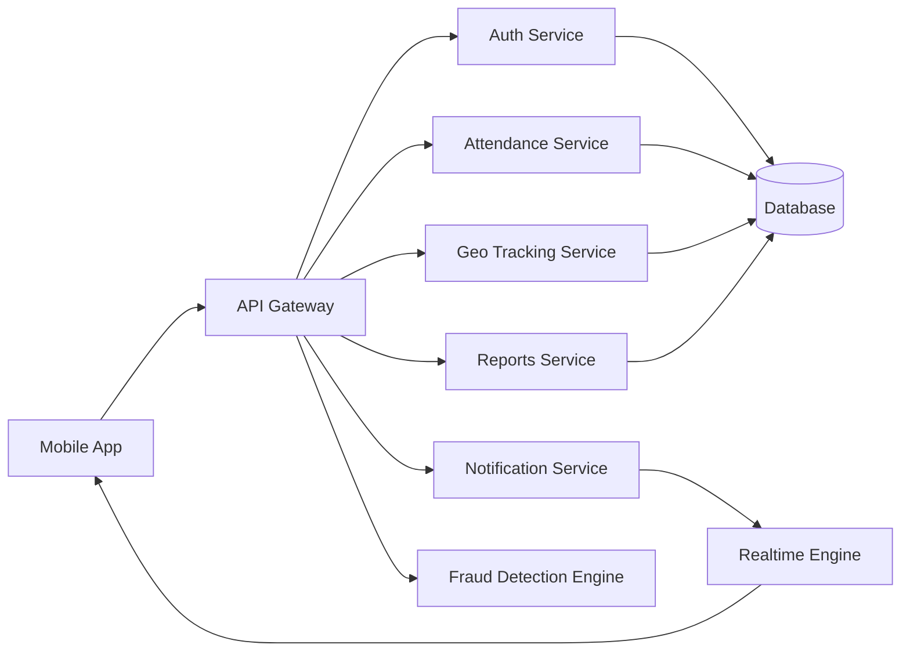
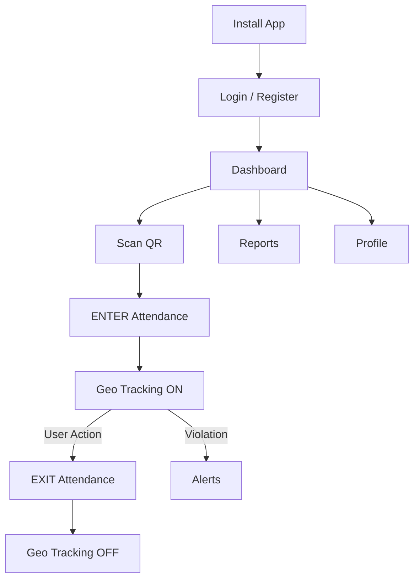
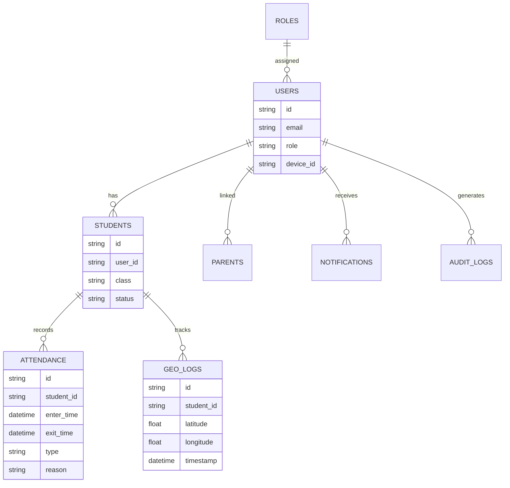
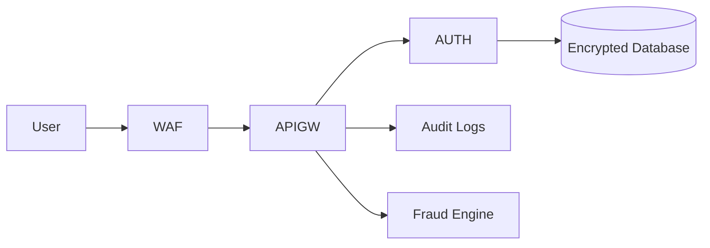

# MONITORING — Smart Campus Monitoring & Attendance Platform

## Overview

**MONITORING** is a Smart Campus SaaS platform for Schools, Colleges, and Institutes that provides:

- QR Based Attendance
- Real‑time Geo Tracking
- Parent Live Monitoring
- Fraud Detection
- Manual Attendance Backup
- Role & Permission Based Access
- Security & Audit Logs
- Reports & Analytics

This system improves **discipline, safety, transparency, and automation** across educational institutions.

---

# Core Features

## QR Attendance

- Unique QR per college
- ENTER / EXIT attendance
- One ENTER & EXIT per day
- Late & early exit rules
- Time window validation

## Manual Attendance

- Teacher / Principal / Management can add
- ENTER + EXIT mandatory
- Late reason required
- Audit tracking (who added)

## Geo Tracking

- Live location after ENTER
- Geo radius monitoring
- Alert if student leaves campus
- Geo timeline tracking

## Notification Engine

- Admin -> Teacher / Student
- Teacher -> Student
- Custom + system alerts
- Geo violation alerts

## Reports & Analytics

- Monthly attendance report
- Performance analytics
- Discipline score
- Geo violation tracking

## Parents Monitoring

- Live child location (always ON)
- Attendance & reports
- Alerts & notifications
- Performance tracking

## Security

- JWT + Device Binding
- RBAC + Permission
- Fake GPS detection
- Fraud detection
- Immutable audit logs
- Encrypted data

---

# Roles

- SuperAdmin
- TechTeam
- Principal
- CollegeManagement
- Teacher
- Parents
- Student

Each role has **restricted & permission-based access**.

---

# System Architecture Diagram

---

# App Flow Diagram

---

# Database ER Diagram

---

# Security Architecture Diagram

---

# Business Model

- SaaS subscription per student
- Per college license
- Enterprise version
- Add‑on analytics & security

---

# Future Enhancements

- Face Recognition Attendance
- AI Risk Detection
- SOS Emergency Button
- Offline Sync
- Multi‑Campus Support
- ERP Integration
- Security Dashboard

---

# Conclusion

**MONITORING** is a complete **Smart, Secure, and Scalable Campus Monitoring Platform** providing real-time tracking, fraud-resistant attendance, parent transparency, and enterprise-grade security.
