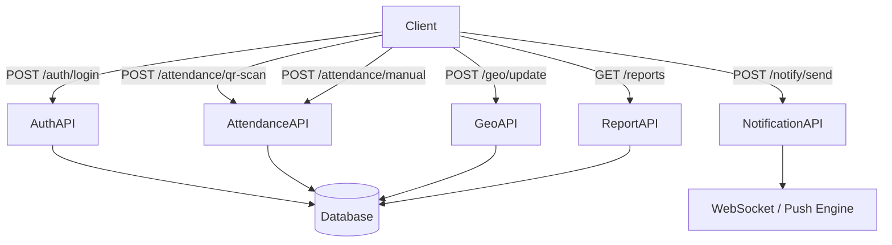

# API Design

```mermaid
flowchart TD
    Client -->|POST /auth/login| AuthAPI
    Client -->|POST /attendance/qr-scan| AttendanceAPI
    Client -->|POST /attendance/manual| AttendanceAPI
    Client -->|POST /geo/update| GeoAPI
    Client -->|GET /reports| ReportAPI
    Client -->|POST /notify/send| NotificationAPI

    AuthAPI --> DB[(Database)]
    AttendanceAPI --> DB
    GeoAPI --> DB
    ReportAPI --> DB
    NotificationAPI --> Realtime[WebSocket / Push Engine]
```
