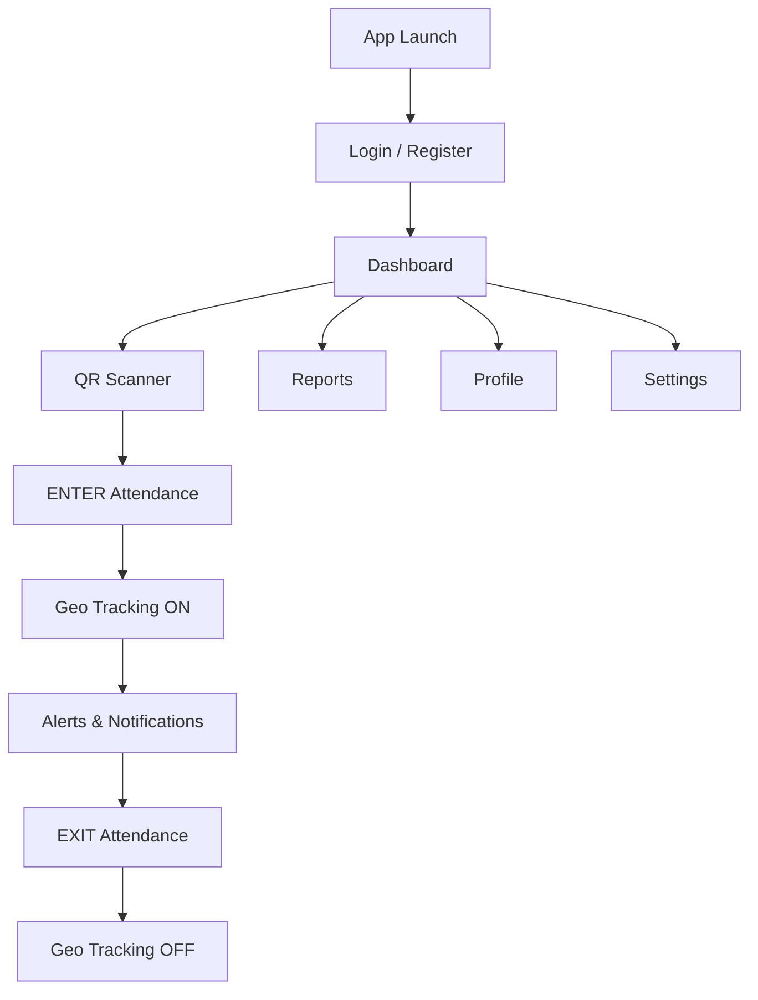

# APK Design (React Native)

```mermaid
flowchart TD
    A[App Launch] --> B[Login / Register]
    B --> C[Dashboard]

    C --> D[QR Scanner]
    D --> E[ENTER Attendance]
    E --> F[Geo Tracking ON]

    F --> G[Alerts & Notifications]
    G --> H[EXIT Attendance]
    H --> I[Geo Tracking OFF]

    C --> J[Reports]
    C --> K[Profile]
    C --> L[Settings]
```
