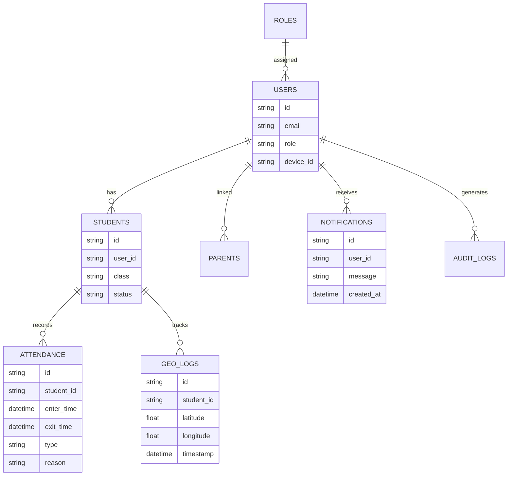

# Database Design

```mermaid
erDiagram
    USERS ||--o{ STUDENTS : has
    USERS ||--o{ PARENTS : linked
    STUDENTS ||--o{ ATTENDANCE : records
    STUDENTS ||--o{ GEO_LOGS : tracks
    USERS ||--o{ NOTIFICATIONS : receives
    USERS ||--o{ AUDIT_LOGS : generates
    ROLES ||--o{ USERS : assigned

    USERS {
        string id
        string email
        string role
        string device_id
    }

    STUDENTS {
        string id
        string user_id
        string class
        string status
    }

    ATTENDANCE {
        string id
        string student_id
        datetime enter_time
        datetime exit_time
        string type
        string reason
    }

    GEO_LOGS {
        string id
        string student_id
        float latitude
        float longitude
        datetime timestamp
    }

    NOTIFICATIONS {
        string id
        string user_id
        string message
        datetime created_at
    }
```
