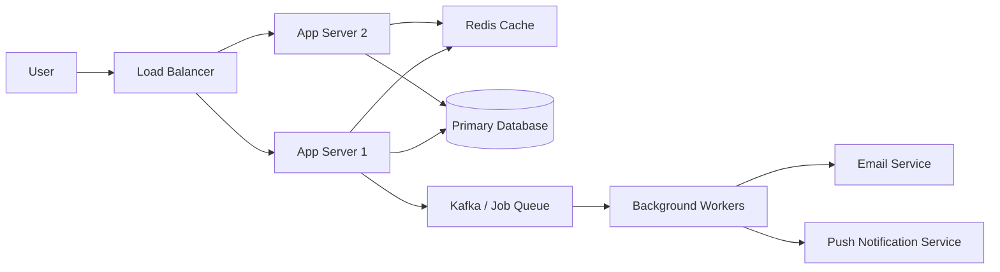

# Server Design

```mermaid
flowchart LR
    User --> LB[Load Balancer]
    LB --> S1[App Server 1]
    LB --> S2[App Server 2]

    S1 --> Cache[Redis Cache]
    S2 --> Cache

    S1 --> DB[(Primary Database)]
    S2 --> DB

    S1 --> Queue[Kafka / Job Queue]
    Queue --> Worker[Background Workers]

    Worker --> Email[Email Service]
    Worker --> Push[Push Notification Service]
```
