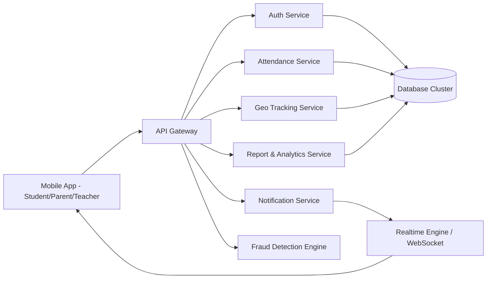

# System Design

```mermaid
flowchart LR
    A[Mobile App - Student/Parent/Teacher] --> B[API Gateway]
    B --> C[Auth Service]
    B --> D[Attendance Service]
    B --> E[Geo Tracking Service]
    B --> F[Notification Service]
    B --> G[Report & Analytics Service]
    B --> H[Fraud Detection Engine]

    C --> DB[(Database Cluster)]
    D --> DB
    E --> DB
    G --> DB

    F --> RT[Realtime Engine / WebSocket]
    RT --> A
```
